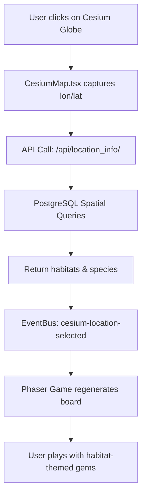

# Habitat Match-3 Game System - Onboarding Guide

## System Overview

This project integrates a match-3 puzzle game with real-world habitat and species data visualization. Users interact with a 3D globe to select locations, which triggers database queries for local habitat types and species, dynamically influencing the game board generation.

## Architecture Components

### 1. Frontend Application (localhost:3000)
- **Technology**: Next.js 15.3.1 + React 18 + TypeScript (migration in progress)
- **Game Engine**: Phaser 3.90.0
- **3D Globe**: Cesium via Resium
- **Communication**: EventBus pattern for React-Phaser integration

### 2. Backend Services (localhost:8000)
- **Framework**: FastAPI with TiTiler
- **Functions**:
  - Tile server for habitat raster data (COG format)
  - API endpoint for location-based queries
  - Custom colormap support for habitat visualization

### 3. Database (localhost:5432)
- **System**: PostgreSQL 17 with PostGIS extension
- **Database**: `phaser`
- **Key Tables**:
  - `public.habitat_raster_full_in_db` - Raster habitat data
  - `public.iucn_gymnophiona_ranges` - Species range polygons

### 4. Additional Services
- **CORS Server** (localhost:9000) - Serves standalone Cesium test page

## Data Flow



## Setup Instructions

### 1. Prerequisites
- Node.js and npm
- Python 3.8+
- PostgreSQL 17 with PostGIS
- OSGeo4W (for GDAL/raster2pgsql tools)

### 2. Database Setup

```bash
# Create database
createdb phaser

# Enable PostGIS extension
psql -d phaser -c "CREATE EXTENSION postgis;"

# Load habitat raster data (PowerShell)
./load_cog.ps1

# Load species shapefile (PowerShell)
./load_species_gym.ps1
```

### 3. Backend Setup

```bash
# Create Python virtual environment
python -m venv venv
source venv/bin/activate  # On Windows: venv\Scripts\activate

# Install dependencies
pip install fastapi uvicorn titiler psycopg2-binary

# Set environment variables
export DB_PASSWORD="your_password"
export TITILER_API_ALLOW_FILE_ACCESS="true"  # For development only

# Start TiTiler/FastAPI server
uvicorn app.main:app --reload --port 8000
```

### 4. Frontend Setup

```bash
# Install dependencies
npm install

# Start development server
npm run dev
```

### 5. Optional: CORS Server (for standalone testing)

```bash
# Navigate to cesium_titiler_test directory
python cors_server.py
# Access test page at http://localhost:9000
```

## Key Integration Points

### 1. Habitat Value to Gem Color Mapping

The game converts numeric habitat codes to gem colors:

```javascript
// src/game/constants.js (needs creation)
export const HABITAT_GEM_MAP = {
  // Forests (100-109) → Green gems
  100: 'green', 101: 'green', 102: 'green', ...
  
  // Savannas (200-202) → Orange gems  
  200: 'orange', 201: 'orange', 202: 'orange',
  
  // Wetlands (500-518) → Blue gems
  500: 'blue', 501: 'blue', ...
  
  // Urban (1400-1406) → Red gems
  1400: 'red', 1401: 'red', ...
};
```

### 2. EventBus Communication

```typescript
// Cesium to Phaser
EventBus.emit('cesium-location-selected', {
  lon: number,
  lat: number,
  habitats: number[],
  species: string[]
});

// Phaser Scene listens
EventBus.on('cesium-location-selected', (data) => {
  this.regenerateBoard(data.habitats);
});
```

### 3. API Response Format

```json
GET /api/location_info/?lon=-98.5&lat=39.5

Response:
{
  "habitats": [100, 101, 200],
  "species": ["Epicrionops petersi", "Caecilia gracilis"]
}
```

## Database Queries

### Habitat Sampling (1km radius)
```sql
-- Samples habitat values within 1km of clicked point
WITH buffer_geom AS (
  SELECT ST_Buffer(
    ST_Transform(ST_SetSRID(ST_MakePoint(lon, lat), 4326), 3857), 
    1000
  ) AS geom
)
SELECT DISTINCT (ST_ValueCount(ST_Clip(rast, 1, buffer_geom.geom, true))).value
FROM public.habitat_raster_full_in_db, buffer_geom
WHERE ST_Intersects(rast, buffer_geom.geom);
```

### Species Range Intersection (10km radius)
```sql
-- Finds species whose ranges intersect 10km buffer
WITH buffered_point AS (
  SELECT ST_Buffer(
    ST_SetSRID(ST_MakePoint(lon, lat), 4326)::geography, 
    10000
  ) AS buffered_geog
)
SELECT DISTINCT sci_name 
FROM public.iucn_gymnophiona_ranges, buffered_point
WHERE ST_Intersects(geom::geography, buffered_geog);
```

## Development Workflow

1. **Start all services**:
   ```bash
   # Terminal 1: Database
   pg_ctl start -D /path/to/data
   
   # Terminal 2: Backend
   uvicorn app.main:app --reload --port 8000
   
   # Terminal 3: Frontend
   npm run dev
   ```

2. **Test the integration**:
   - Open http://localhost:3000
   - Click on the Cesium globe
   - Verify habitat/species data appears
   - Check that game board reflects habitat distribution

3. **Debug endpoints**:
   - TileJSON: http://localhost:8000/cog/WebMercatorQuad/tilejson.json?url=...
   - API: http://localhost:8000/api/location_info/?lon=-98&lat=39
   - Docs: http://localhost:8000/docs

## Common Issues & Solutions

### Issue: "habitat_colormap.json not found"
**Solution**: Ensure the file exists at project root and app/ directory

### Issue: "PROJ_LIB not set"
**Solution**: Set environment variable to OSGeo4W proj directory:
```bash
export PROJ_LIB="C:/OSGeo4W/share/proj"
```

### Issue: Database connection failed
**Solution**: Check PostgreSQL is running and credentials in app/main.py

### Issue: CORS errors
**Solution**: Ensure backend CORS middleware includes your frontend URL

## Performance Considerations

1. **Raster queries can be slow** - Consider adding caching layer
2. **Large species tables** - Ensure spatial indexes are created
3. **Tile generation** - Monitor TiTiler performance under load

## Security Notes

⚠️ **For Development Only**:
- Database passwords are hardcoded
- Local file access is enabled for TiTiler
- No authentication on API endpoints

**Production Requirements**:
- Use environment variables for all secrets
- Implement API authentication
- Restrict TiTiler to S3/cloud storage
- Add rate limiting
- Enable HTTPS

## Next Steps

1. Complete TypeScript migration
2. Implement game state persistence
3. Add multiplayer support
4. Deploy to cloud infrastructure
5. Add more species datasets
6. Implement achievement system based on species discovered

## Resources

- [TiTiler Documentation](https://developmentseed.org/titiler/)
- [Cesium Documentation](https://cesium.com/docs/)
- [PostGIS Documentation](https://postgis.net/documentation/)
- [Phaser 3 Documentation](https://phaser.io/phaser3)

## Architecture Diagram

```
┌─────────────────────────────────────────────────────────────────────┐
│                        User's Browser                                │
│  ┌─────────────────────────────────────────────────────────────┐   │
│  │                    Next.js Application                       │   │
│  │  ┌─────────────┐        ┌──────────────┐                   │   │
│  │  │ CesiumMap   │───────>│  EventBus    │                   │   │
│  │  │ Component   │        └──────────────┘                   │   │
│  │  └─────────────┘               │                            │   │
│  │         │                      v                            │   │
│  │         │              ┌──────────────┐                     │   │
│  │         │              │ Phaser Game  │                     │   │
│  │         │              │   Scene      │                     │   │
│  │         │              └──────────────┘                     │   │
│  └─────────│───────────────────────────────────────────────────┘   │
│            │                                                        │
└────────────│────────────────────────────────────────────────────────┘
             │
             v
┌─────────────────────────────────────────────────────────────────────┐
│                      Backend Services                                │
│  ┌─────────────────────────────────────────────────────────────┐   │
│  │                 TiTiler + FastAPI (Port 8000)               │   │
│  │  ┌──────────────┐        ┌────────────────────────┐        │   │
│  │  │ Tile Server  │        │  /api/location_info/   │        │   │
│  │  │   (COG)      │        │    Endpoint            │        │   │
│  │  └──────────────┘        └────────────────────────┘        │   │
│  │         │                           │                        │   │
│  └─────────│───────────────────────────│───────────────────────┘   │
│            │                           │                            │
│            v                           v                            │
│  ┌─────────────────────────────────────────────────────────────┐   │
│  │              PostgreSQL + PostGIS (Port 5432)               │   │
│  │  ┌──────────────────┐     ┌─────────────────────┐          │   │
│  │  │ habitat_raster   │     │ species_ranges      │          │   │
│  │  │ (Raster Data)    │     │ (Vector Polygons)   │          │   │
│  │  └──────────────────┘     └─────────────────────┘          │   │
│  └─────────────────────────────────────────────────────────────┘   │
└─────────────────────────────────────────────────────────────────────┘
```