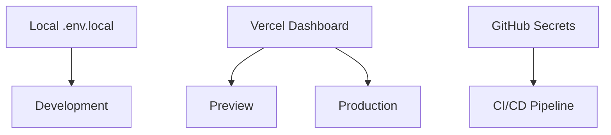

# Vercel Environment Setup Guide

## Overview

This guide provides comprehensive instructions for setting up and managing environments for the Phaser habitat game deployment on Vercel. It covers development, preview, and production environment configurations, as well as local testing procedures.

## Environment Strategy

### Environment Types

1. **Development (Local)**: Local development with hot reloading
2. **Preview (Vercel)**: Branch-based deployments for testing
3. **Production (Vercel)**: Live application deployment
4. **Staging (Optional)**: Pre-production testing environment

### Environment Variable Management



## Local Development Environment

### Setup Instructions

#### 1. Initial Environment Configuration

```bash
# Clone repository (if not already done)
git clone https://github.com/your-username/phaser-habitat-game.git
cd phaser-habitat-game

# Install dependencies
npm install

# Create local environment file
cp .env.example .env.local
```

#### 2. Configure `.env.local` for Development

```bash
# =================================
# Development Environment Variables
# =================================

# Supabase Configuration
NEXT_PUBLIC_SUPABASE_URL=https://abhhfiazxykwcpkyvavk.supabase.co
NEXT_PUBLIC_SUPABASE_ANON_KEY=eyJhbGciOiJIUzI1NiIsInR5cCI6IkpXVCJ9...

# TiTiler Configuration
NEXT_PUBLIC_TITILER_BASE_URL=https://azure-local-dfgagqgub7fhb5fv.eastus-01.azurewebsites.net
NEXT_PUBLIC_COG_URL=https://azurecog.blob.core.windows.net/cogtif/habitat_cog.tif

# Cesium Configuration
NEXT_PUBLIC_CESIUM_ION_TOKEN=eyJhbGciOiJIUzI1NiIsInR5cCI6IkpXVCJ9...

# Development Flags
NODE_ENV=development
ANALYZE=false

# Optional: API debugging
NEXT_PUBLIC_DEBUG_MODE=true
NEXT_PUBLIC_LOG_LEVEL=debug
```

#### 3. Development Scripts

```json
{
  "scripts": {
    "dev": "next dev -p 8080",
    "dev-debug": "NODE_ENV=development DEBUG=* next dev -p 8080",
    "dev-local": "node log.js dev & next dev -p 8080",
    "dev-clean": "npm run clean && npm run dev"
  }
}
```

#### 4. Local Testing Commands

```bash
# Start development server
npm run dev

# Start with original analytics logging
npm run dev-local

# Start with debugging enabled
npm run dev-debug

# Clean build and restart
npm run dev-clean

# Test production build locally
npm run build && npm run serve
```

### Development Environment Validation

```bash
# Check environment variables
node -e "console.log('Supabase URL:', process.env.NEXT_PUBLIC_SUPABASE_URL)"

# Test local build
npm run build

# Validate TypeScript
npm run typecheck

# Test Cesium assets
ls -la public/cesium
```

## Vercel Environment Configuration

### Environment Variable Setup

#### 1. Access Vercel Dashboard
1. Navigate to [vercel.com/dashboard](https://vercel.com/dashboard)
2. Select your project
3. Go to **Settings** → **Environment Variables**

#### 2. Production Environment Variables

```bash
# Required Production Variables
NEXT_PUBLIC_SUPABASE_URL=https://abhhfiazxykwcpkyvavk.supabase.co
NEXT_PUBLIC_SUPABASE_ANON_KEY=eyJhbGciOiJIUzI1NiIsInR5cCI6IkpXVCJ9...
NEXT_PUBLIC_TITILER_BASE_URL=https://azure-local-dfgagqgub7fhb5fv.eastus-01.azurewebsites.net
NEXT_PUBLIC_COG_URL=https://azurecog.blob.core.windows.net/cogtif/habitat_cog.tif
NEXT_PUBLIC_CESIUM_ION_TOKEN=eyJhbGciOiJIUzI1NiIsInR5cCI6IkpXVCJ9...

# Optional Production Variables
NEXT_PUBLIC_ANALYTICS_ENABLED=true
NEXT_PUBLIC_ERROR_TRACKING=true
```

#### 3. Preview Environment Variables

```bash
# Preview environments typically use same values as production
# But you might want different endpoints for testing:

NEXT_PUBLIC_SUPABASE_URL=https://your-staging-project.supabase.co
NEXT_PUBLIC_TITILER_BASE_URL=https://staging-titiler.azurewebsites.net

# Debug flags for preview
NEXT_PUBLIC_DEBUG_MODE=true
NEXT_PUBLIC_LOG_LEVEL=info
```

#### 4. Environment-Specific Configuration

**Configure for Different Environments**:

| Variable | Production | Preview | Development |
|----------|------------|---------|-------------|
| `NEXT_PUBLIC_DEBUG_MODE` | `false` | `true` | `true` |
| `NEXT_PUBLIC_LOG_LEVEL` | `error` | `info` | `debug` |
| `NEXT_PUBLIC_ANALYTICS_ENABLED` | `true` | `false` | `false` |
| `NODE_ENV` | `production` | `production` | `development` |

### Vercel CLI Environment Management

#### 1. Install and Setup Vercel CLI

```bash
# Install Vercel CLI
npm install -g vercel

# Login to Vercel
vercel login

# Link project
vercel link
```

#### 2. Environment Management Commands

```bash
# Pull environment variables from Vercel
vercel env pull .env.vercel

# Add new environment variable
vercel env add NEXT_PUBLIC_NEW_VAR

# List all environment variables
vercel env ls

# Remove environment variable
vercel env rm VARIABLE_NAME
```

#### 3. Local Development with Vercel CLI

```bash
# Run development server with Vercel environment
vercel dev

# Run with specific environment
vercel dev --env VERCEL_ENV=preview

# Build and test locally with Vercel settings
vercel build
```

## Environment-Specific Configurations

### Runtime Environment Detection

Create `utils/environment.ts`:

```typescript
export interface EnvironmentConfig {
  isDevelopment: boolean;
  isProduction: boolean;
  isPreview: boolean;
  isVercel: boolean;
  deploymentUrl: string;
  debugMode: boolean;
  logLevel: 'debug' | 'info' | 'warn' | 'error';
}

export function getEnvironmentConfig(): EnvironmentConfig {
  const isDevelopment = process.env.NODE_ENV === 'development';
  const isProduction = process.env.NODE_ENV === 'production';
  const isVercel = !!process.env.VERCEL;
  const isPreview = process.env.VERCEL_ENV === 'preview';
  
  return {
    isDevelopment,
    isProduction,
    isPreview,
    isVercel,
    deploymentUrl: process.env.NEXT_PUBLIC_VERCEL_URL || 'localhost:8080',
    debugMode: process.env.NEXT_PUBLIC_DEBUG_MODE === 'true' || isDevelopment,
    logLevel: (process.env.NEXT_PUBLIC_LOG_LEVEL as any) || (isDevelopment ? 'debug' : 'error')
  };
}

// Usage in components
import { getEnvironmentConfig } from '@/utils/environment';

const config = getEnvironmentConfig();
if (config.debugMode) {
  console.log('Debug mode enabled');
}
```

### Environment-Specific API Configuration

Create `lib/api-config.ts`:

```typescript
import { getEnvironmentConfig } from '@/utils/environment';

export function getApiConfig() {
  const env = getEnvironmentConfig();
  
  const baseConfig = {
    supabase: {
      url: process.env.NEXT_PUBLIC_SUPABASE_URL!,
      anonKey: process.env.NEXT_PUBLIC_SUPABASE_ANON_KEY!
    },
    titiler: {
      baseUrl: process.env.NEXT_PUBLIC_TITILER_BASE_URL!,
      cogUrl: process.env.NEXT_PUBLIC_COG_URL!
    },
    cesium: {
      ionToken: process.env.NEXT_PUBLIC_CESIUM_ION_TOKEN!,
      baseUrl: '/cesium/'
    }
  };
  
  // Environment-specific overrides
  if (env.isDevelopment) {
    return {
      ...baseConfig,
      debug: true,
      retryAttempts: 3,
      timeout: 10000
    };
  }
  
  if (env.isPreview) {
    return {
      ...baseConfig,
      debug: true,
      retryAttempts: 2,
      timeout: 8000
    };
  }
  
  // Production configuration
  return {
    ...baseConfig,
    debug: false,
    retryAttempts: 1,
    timeout: 5000
  };
}
```

## Environment Testing Procedures

### Local Environment Testing

#### 1. Development Server Testing

```bash
# Test development server
npm run dev

# Verification checklist:
# [ ] Application loads on http://localhost:8080
# [ ] Hot reloading works
# [ ] Environment variables are loaded
# [ ] Cesium globe renders
# [ ] Supabase connectivity works
# [ ] Console shows debug information
```

#### 2. Production Build Testing Locally

```bash
# Build for production
npm run build

# Serve production build
npm run serve

# Test production build:
# [ ] Static export generates dist/ folder
# [ ] All assets are included
# [ ] Application runs without errors
# [ ] Performance is acceptable
# [ ] No development-only features active
```

#### 3. Environment Variable Testing

```bash
# Create test script: scripts/test-env.js
const env = require('dotenv').config({ path: '.env.local' });

const requiredVars = [
  'NEXT_PUBLIC_SUPABASE_URL',
  'NEXT_PUBLIC_SUPABASE_ANON_KEY', 
  'NEXT_PUBLIC_TITILER_BASE_URL',
  'NEXT_PUBLIC_COG_URL',
  'NEXT_PUBLIC_CESIUM_ION_TOKEN'
];

console.log('Testing environment variables...');
requiredVars.forEach(varName => {
  const value = process.env[varName];
  console.log(`${varName}: ${value ? '✅ Set' : '❌ Missing'}`);
});
```

### Vercel Environment Testing

#### 1. Preview Deployment Testing

```bash
# Deploy to preview
git push origin feature-branch

# Or manually trigger preview
vercel

# Test preview deployment:
# [ ] Preview URL works
# [ ] All functionality intact
# [ ] Environment variables correct
# [ ] Performance acceptable
# [ ] No production data affected
```

#### 2. Production Deployment Testing

```bash
# Deploy to production
vercel --prod

# Or via GitHub
git push origin main

# Production testing checklist:
# [ ] Custom domain works (if configured)
# [ ] SSL certificate active
# [ ] All environment variables set
# [ ] Performance monitoring active
# [ ] Error tracking working
# [ ] Analytics functioning
```

### Environment Validation Scripts

#### `scripts/validate-environment.js`

```javascript
const https = require('https');
const { URL } = require('url');

async function validateEnvironment() {
  console.log('🔍 Validating environment configuration...');
  
  const tests = [
    {
      name: 'Supabase Connection',
      url: process.env.NEXT_PUBLIC_SUPABASE_URL,
      test: async (url) => {
        const response = await fetch(`${url}/rest/v1/`);
        return response.status === 200 || response.status === 401; // 401 is OK (auth required)
      }
    },
    {
      name: 'TiTiler Service',
      url: process.env.NEXT_PUBLIC_TITILER_BASE_URL,
      test: async (url) => {
        const response = await fetch(url);
        return response.status < 500; // Any non-server error is OK
      }
    },
    {
      name: 'COG File Access',
      url: process.env.NEXT_PUBLIC_COG_URL,
      test: async (url) => {
        const response = await fetch(url, { method: 'HEAD' });
        return response.status === 200;
      }
    }
  ];
  
  for (const test of tests) {
    try {
      const result = await test.test(test.url);
      console.log(`${test.name}: ${result ? '✅ OK' : '❌ Failed'}`);
    } catch (error) {
      console.log(`${test.name}: ❌ Error - ${error.message}`);
    }
  }
}

if (require.main === module) {
  validateEnvironment();
}

module.exports = { validateEnvironment };
```

## Security Best Practices

### Environment Variable Security

#### 1. Secret Management

```bash
# ✅ Correct: Public variables only
NEXT_PUBLIC_SUPABASE_URL=https://project.supabase.co
NEXT_PUBLIC_API_URL=https://api.example.com

# ❌ Incorrect: Never expose secrets
# SUPABASE_SERVICE_ROLE_KEY=secret-key
# DATABASE_PASSWORD=password
```

#### 2. Environment Separation

```typescript
// utils/secrets.ts - Server-side only secrets
export const getServerSecrets = () => {
  if (typeof window !== 'undefined') {
    throw new Error('Server secrets cannot be accessed on client side');
  }
  
  return {
    supabaseServiceKey: process.env.SUPABASE_SERVICE_ROLE_KEY,
    databaseUrl: process.env.DATABASE_URL
  };
};

// utils/public-config.ts - Client-safe configuration
export const getPublicConfig = () => ({
  supabaseUrl: process.env.NEXT_PUBLIC_SUPABASE_URL,
  supabaseAnonKey: process.env.NEXT_PUBLIC_SUPABASE_ANON_KEY,
  titilerUrl: process.env.NEXT_PUBLIC_TITILER_BASE_URL
});
```

#### 3. Runtime Validation

```typescript
// lib/env-validation.ts
import { z } from 'zod';

const envSchema = z.object({
  NEXT_PUBLIC_SUPABASE_URL: z.string().url(),
  NEXT_PUBLIC_SUPABASE_ANON_KEY: z.string().min(1),
  NEXT_PUBLIC_TITILER_BASE_URL: z.string().url(),
  NEXT_PUBLIC_COG_URL: z.string().url(),
  NEXT_PUBLIC_CESIUM_ION_TOKEN: z.string().min(1),
  NODE_ENV: z.enum(['development', 'production', 'test']).default('development')
});

export function validateEnv() {
  try {
    return envSchema.parse(process.env);
  } catch (error) {
    console.error('❌ Environment validation failed:', error);
    throw new Error('Invalid environment configuration');
  }
}
```

## Environment Monitoring

### Performance Monitoring by Environment

```typescript
// utils/monitoring.ts
import { getEnvironmentConfig } from './environment';

export function initializeMonitoring() {
  const env = getEnvironmentConfig();
  
  if (env.isProduction) {
    // Production monitoring
    console.log('📊 Production monitoring initialized');
    // Initialize error tracking, analytics, etc.
  } else if (env.isPreview) {
    // Preview monitoring (lighter)
    console.log('🔍 Preview monitoring initialized');
  } else {
    // Development monitoring
    console.log('🛠 Development monitoring initialized');
  }
}
```

### Environment Health Checks

```typescript
// utils/health-check.ts
export async function performHealthCheck() {
  const checks = [
    {
      name: 'Supabase Connection',
      check: async () => {
        // Test Supabase connection
        const response = await fetch(
          `${process.env.NEXT_PUBLIC_SUPABASE_URL}/rest/v1/health`,
          { method: 'HEAD' }
        );
        return response.ok;
      }
    },
    {
      name: 'TiTiler Service',
      check: async () => {
        // Test TiTiler service
        const response = await fetch(process.env.NEXT_PUBLIC_TITILER_BASE_URL);
        return response.status < 500;
      }
    }
  ];
  
  const results = await Promise.allSettled(
    checks.map(async ({ name, check }) => ({
      name,
      status: await check()
    }))
  );
  
  return results.map((result, index) => ({
    name: checks[index].name,
    status: result.status === 'fulfilled' ? result.value.status : false,
    error: result.status === 'rejected' ? result.reason : null
  }));
}
```

## Troubleshooting Environment Issues

### Common Environment Problems

#### 1. Missing Environment Variables

```bash
# Symptom: Application fails to load
# Solution: Check environment variable configuration

# Debug command
node -e "console.log('Env vars:', Object.keys(process.env).filter(k => k.startsWith('NEXT_PUBLIC_')))"
```

#### 2. Environment Variable Not Updating

```bash
# Clear Next.js cache
rm -rf .next

# Restart development server
npm run dev

# For Vercel: redeploy
vercel --prod
```

#### 3. Different Behavior Between Environments

```typescript
// Add environment debugging to your application
console.log('Environment:', {
  NODE_ENV: process.env.NODE_ENV,
  VERCEL_ENV: process.env.VERCEL_ENV,
  isClient: typeof window !== 'undefined'
});
```

### Environment Debug Commands

```bash
# Check local environment
npm run dev-debug

# Validate environment variables
node scripts/validate-environment.js

# Test production build locally
npm run build && npm run serve

# Compare environments
vercel env pull .env.vercel
diff .env.local .env.vercel
```

## Environment Migration Checklist

### Pre-Migration Checklist

```markdown
- [ ] All environment variables documented
- [ ] Local development working
- [ ] Production build tested locally
- [ ] Environment validation scripts passing
- [ ] Security review completed
- [ ] Backup procedures documented
```

### Post-Migration Checklist

```markdown
- [ ] Vercel environment variables configured
- [ ] Preview deployments working
- [ ] Production deployment successful
- [ ] All functionality tested
- [ ] Performance monitoring active
- [ ] Error tracking configured
- [ ] Team access properly configured
```

This comprehensive environment setup guide ensures proper configuration across all deployment environments while maintaining security and performance standards.