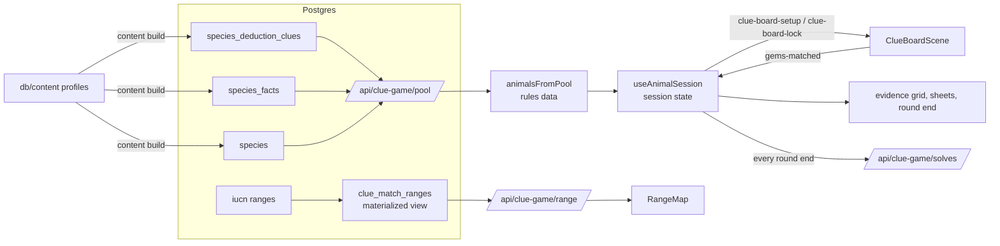

# Critter Connect: the globe and the game

> `/explore` plays the plan 044 animal board (five suspects pinned on the board, clue orders, Rule out and release; rules in `docs/ANIMAL_BOARD_PAPER.md` and `plans/044-animal-board.md`). `npm run e2e` checks that game.

The app has two screens. (The game was called Clue Match until plan 041; code and tables still say `clue`, players never see the word.)

- **Globe (`/`).** A globe beside the list of continents. Pick one, or tap its dot: the globe flies there and outlines it, and a card shows how many animals live there (named once you've found them) and a habitat picture. **Explore** opens the game with that continent's animals. A continent opens once it has 12 animals; smaller ones show "coming soon". **Anywhere** plays animals from the whole world. Animals you've found glow on the globe where you found them: green for amphibians and reptiles, amber for mammals.
- **The game (`/explore`, optional `?place=continent:africa` and `?seed=N`).** Five look-alike suspects sit pinned on a 7×7 board, and one is the mystery. Matching gems fills clue orders that answer yes/no questions; the player rules suspects out in the evidence grid and releases them from the board. Old `/clue-match` links redirect here with their query.

No sign-in needed; every finished round, solved or lost, is saved to `clue_match_solves` for analysis (with the player's profile id when signed in, and the continent when played from the globe). The Field Journal lives on the device; when signed in, it also pulls the player's saved solves, so it follows them to another device. `?seed=N` replays a session exactly (same mysteries, same boards).

## Where the code lives

| Part | Path |
|---|---|
| Globe | `src/pages/index.tsx` → `src/components/globe/` (GlobeScreen, Globe, PlaceList, PlaceCard); helpers `src/clueGame/places.ts`; data `GET /api/places`, `/api/places/outline` (`src/lib/places.ts`) |
| Game page | `src/pages/explore.tsx` → `src/components/animalBoard/AnimalGame.tsx` |
| Page state + board wiring | `src/components/animalBoard/useAnimalSession.ts` |
| UI pieces | `src/components/animalBoard/` (EvidenceGrid, AnimalSheets, FaceIcon, useShownOrders); shared in `src/components/clueGame/` (Sheet, JournalSheet, GlossaryText, LogEntryText, RangeMap, SpeciesPortrait, PhaserGame, useJournal) |
| Rules (pure) | `src/clueGame/animalBoard.ts` (suspects, clue orders, marks, release), `animalSession.ts` (the trail: rounds, hearts, score, streak), `questionMatch.ts` (questions, book, columns), `gems.ts` (gem color ↔ category) |
| Content → rules data | `src/clueGame/questionMatchContent.ts` (traits, regions, family tree names, field notes with blanks, sources), `regions.ts` (every country → UN region with kid names → continent) |
| Board | `src/game/`: `ClueBoardScene.ts` (seeded 7×7 board), `BoardModel.ts` (swaps, matches, toys, the rare note gem), `BoardView.ts` (sprites, toy effects), `toyTextures.ts` (toy looks), `sfx.ts` (sounds), `BoardController.ts` (swipe, tap, keyboard, cascade loop) |
| Data | `GET /api/clue-game/pool` (`src/lib/cluePool.ts`), `GET /api/clue-game/range?species=<id>`, `POST /api/clue-game/solves` (checked by `src/clueGame/solveReport.ts`), `GET /api/clue-game/journal` (a signed-in player's solves) |
| Content | `db/content/` (profiles + source registry, docs/CONTENT_SOURCES.md), `scripts/content.ts` (`npm run content`), `src/clueGame/profiles.ts` (profile → rows) |
| Balance | `scripts/balance-044.ts` (seeded bot on the real rules and board) |
| Tests | `tests/clueGame/*`, `tests/game/*`; `npm run e2e` |

## How it fits together

The board only reports matches (`gems-matched`, one event per explode phase, with each group's color and size, and `blast` for gems a toy cleared). React owns everything else. Keyboard: the board is focusable; React forwards arrows, Shift+arrows and Esc (`clue-board-key`). Arrows move a cursor, Shift+arrows swap its gem with the neighbor that way, Esc drops a tapped gem. The board describes each step (`clue-board-announce`) in a screen-reader live region. Outside a playing round the board is locked (`clue-board-lock`).

## Rules

Rules 044-0, saved with every round as `rules_version` (numbers in `ANIMAL_RULES`, `src/clueGame/animalBoard.ts`). The full rules, a worked example and why random play fails: `docs/ANIMAL_BOARD_PAPER.md` §2–3. Design and decisions: `plans/044-animal-board.md`; terms: `CONTEXT.md`.

In short: five look-alike suspects are pinned on a 7×7 board, one of them the mystery. Matching gems fills four clue orders; a full order answers one yes/no question about the mystery. Witness gems, collected next to a match, show the mystery's hand-written clues. The player compares the answers with each suspect's field guide in the evidence grid, marks suspects **Rule out**, and clears gems next to a marked tile to release it. Releasing every look-alike finds the mystery; releasing the mystery lets it escape and loses the round. Out of moves, the player names an animal still on the board: a right name goes in the journal, but the round is lost either way. Rounds make a trail (5 rounds, 3 hearts).

The earlier games (041 charges, 043 gems ask questions) are deleted from the code; their rules are in `plans/041-gameplay-tactics.md` and `plans/043-literal-gems.md`.

## Content: the human in the loop

Content lives in git as one JSON profile per animal (`db/content/animals/`), each fact sourced from a ranked registry (`db/content/sources.json`). docs/CONTENT_SOURCES.md has the source tiers, the tag vocabulary and the workflow:

1. Edit a profile; `npm run content -- preview [name]` shows its clues and problems.
2. New animal: `npm run content -- ranges`, then `npm run content -- photos`.
3. `npm run content -- build` loads the database in one transaction; `npm run content -- check` validates the live pool.
4. If ranges or the set of animals changed: `REFRESH MATERIALIZED VIEW CONCURRENTLY clue_match_ranges;` and `REFRESH MATERIALIZED VIEW CONCURRENTLY clue_match_places;`
5. `npm test`, then play `/explore/?seed=1`.

A profile's `traits` and habitats become the questions; its `clues` and `facts` become field notes (`isHandWrittenClue` in `profiles.ts` tells them apart in the database). Write notes that don't name the animal ("It can't purr", not "Tigers can't purr"): named words become blanks. Countries come from the range maps for now; plan 041 (review fix 6) moves them to IUCN countries of occurrence.

**Plain words.** Players are in grades 6–12. Science words stay (they are part of the lesson), and `src/clueGame/glossary.ts` gives each one a tap-to-read definition in the field guide and on the reveal card. Add a glossary entry when new content brings a new term.

## Database

`db/schema.sql` is the schema the app uses: the content tables (`content_sources`, `species` with Red List link and photo credit, `species_deduction_clues` and `species_facts` with their sources), `profiles`, `clue_match_solves`, and two materialized views. `clue_match_solves` has a row per finished round: `outcome` (`solved` or `lost`; rows before plan 041 are `solved`), `last_chance` (from rules 041-2, so first-try and rescued solves can be told apart), `rules_version`, moves used and left, wrong guesses, animals standing at the guess, notes saved, family tree steps and every question with its answer. The journal counts only `solved` rows. `clue_match_ranges` holds simplified range SVG paths for the reveal card (~10 s to refresh). `clue_match_places` holds the globe's places and who lives there (≥5% or 5,000 km² of a range; the game draws a continent's animals from their countries instead, so counts can differ by one or two). It splits Russia at the Urals and moves France's overseas parts to their continent, and takes ~90 s to refresh. The file is a baseline, not a history: the old migrations 001–044 are in git history. Change the database with SQL, then update the file to match.

The world basemaps (`public/assets/clue-match/world-land.svg` under range maps, `world-land.geojson` on the globe) are drawn from `natural_earth.countries` by `npm run clue:world-map`. The habitat pictures come from TiTiler rendering the habitat GeoTIFF (`NEXT_PUBLIC_TITILER_BASE_URL`, `NEXT_PUBLIC_COG_URL`).

## Practice SQL on this data

`db/analysis/clue-match/` holds read-only queries, each with the SQL ideas it practices and a question to answer:

| File | Practice |
|---|---|
| `01_pool_overview.sql` | JOIN, GROUP BY, `count(*) FILTER (...)`: clue counts per color |
| `02_tag_vocabulary.sql` | `unnest` arrays, HAVING: every tag and who has it |
| `03_realm_clue_power.sql` | CTEs, array operators `&&` `@>`, correlated subqueries: how many species each Range clue rules out |
| `04_realm_shares.sql` | PostGIS `ST_Intersects`, `ST_Intersection`, `ST_Area(geography)`, window functions |
| `05_text_quality.sql` | UNION ALL, regex operators: the validator's text checks in SQL |
| `06_ranges_for_qgis.sql` | `ST_Union`, a geometry layer to load in QGIS over the realm map |
| `07_solve_stats.sql` | `percentile_cont`, `jsonb_array_elements`: hardest animals, most-asked questions, notes and family tree by outcome |

## Checking it as an agent

- `npm run e2e` (with `npm run dev` running): headless Chrome picks the continent with the most animals and plays three rounds at 390×844, through real swipes and buttons.
  - **Each move:** uses exactly one move and settles; tiles never move and a tile shows on each pinned cell; only ruled-out animals leave, and the mystery leaves only by escaping (which loses the round); the grid's Mystery row matches the rules and never points at a mismatch during play.
  - **Every round:** 5 suspects pinned at least 3 apart and never in a corner, the mystery among them; the grid has a row per suspect and a column per clue, counts the player's marks and doesn't name the mystery; Rule out marks a suspect, and ruling out the mystery doesn't release it by itself; the round-end card names the mystery, replays the grid and shows the family tree; the trail moves on (a find, or one heart less). Some rounds cover losing: nobody ruled out runs the moves out (the name sheet shows; lost even if named right), and releasing the ruled-out mystery lets it escape.
  - **Once a run:** sound starts off and the menu's button turns it on; tapping a gem outlines the marked animals its swap would release; a witness note says how many of the 5 field guides agree; the grid leaves the board most of the screen, and on a 375×548 phone the board keeps at least 210 px; the journal counts the animals found; no console errors or failed requests.
  - **Artifact:** `e2e-artifacts/<run>/report.json` and screenshots. `E2E_PLACE`, `E2E_SEED`, `E2E_ROUNDS` change it.
- `node scripts/run-typescript.mjs scripts/balance-044.ts`: the seeded balance table (careful, reader, guesser, random and oracle players; `--explain N` prints one round).
- `npm test`: only what a playtest can't see: content checks, solve-report and localStorage parsing, board invariants. Test by playing first (AGENTS.md, Testing).
- In a dev browser, `window.__cc.clue()` returns the session (rules version, trail and round, status and how it was lost, mystery, suspects, marked, released, moves left, clue orders, notes, who is still possible, score, streak, round end, log tail), `window.__cc.drag(move, { input: 'touch' })` swipes a real move and `window.__cc.tap(cell)` taps. The `playtest` skill (`.claude/skills/playtest/SKILL.md`) lists the invariants to check.
