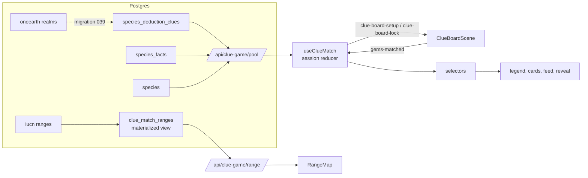

# Clue Match

A fast, mobile-first free-play mode at `/clue-match`. A mystery animal hides among six candidates. Matching gems reveals clues about it: each gem color is one clue category, and each match shows that category's next clue. Clues that can be checked against the candidates' records put colored dots on the candidate cards and rule animals out. Tap the animal you think it is, then **Guess**. A correct guess shows a reveal card (range map, Red List status, a fact), records the animal in the Field Journal, and the next mystery starts.

50 animals: 11 frogs, 11 turtles and tortoises, 28 mammals. No sign-in needed; each solve is saved to `clue_match_solves` for analysis (with the player's profile id when signed in). `?seed=N` replays a session exactly (same mysteries, same starting board).

## Where the code lives

| Part | Path |
|---|---|
| Page | `src/pages/clue-match.tsx` → `src/components/clueGame/ClueMatchGame.tsx` |
| Session state + board wiring | `src/components/clueGame/useClueMatch.ts` |
| UI pieces | `src/components/clueGame/` (TopBar, GemLegend, CandidateGrid, GuessBar, ClueFeed, RevealSheet, RangeMap, JournalSheet, HowToPlay, GlossaryText) |
| Rules (pure, unit-tested) | `src/clueGame/`: `categories` (gem → category), `traits` (species records), `deduction` (how a clue compares with a candidate), `round`, `session` (reducer), `selectors` (what the HUD shows), `validatePool` (content checks), `glossary`, `journal`, `speciesInfo` |
| Board | `src/game/scenes/ClueBoardScene.ts` (square seeded board), `src/game/board/BoardController.ts` (drag + cascade loop shared with the expedition board) |
| Data | `GET /api/clue-game/pool` (`src/lib/cluePool.ts`), `GET /api/clue-game/range?species=<id>`, `POST /api/clue-game/solves` (checked by `src/clueGame/solveReport.ts`) |
| Tests | `tests/clueGame/*`, fixture `tests/fixtures/clueGame/pool.json` |

## How it fits together

The board only reports matches (`gems-matched`, one event per explode phase, with each group's color and size). React owns everything else. While a round is solved the board is locked (`clue-board-lock`), so matches between rounds can't reveal anything.

## Rules

**Gem colors.** red Family tree (taxonomy), orange Body (morphology), yellow Behavior & diet, green Habitat, blue Range (geography), black Life cycle (reproduction), white Conservation, purple Key facts. Each color draws its category's clues in `reveal_order`, then `species_facts` of matching categories as fun notes, then says "No more clues". A group of 4 reveals one extra clue of its color, 5 or more reveal two (`cluesForMatch`).

**Deduction** (`src/clueGame/traits.ts`, `deduction.ts`). A species' record is its taxonomy plus every tag on its own clues. A clue with tags (`is_filtering`) compares the mystery's tags with each candidate's record:

- **fits**: the candidate has every tag. **partial**: some. **unknown**: its record doesn't mention them. That proves nothing, so it never rules anything out.
- **contradicts** (the card is ruled out) only when the records truly disagree:
  - taxonomy: a different class, order, family or genus;
  - exclusive axes: the other value of a pair like `egg_laying` / `live_birth`, `long_lived` / `short_lived`, `carnivore` / `herbivore` (`EXCLUSIVE_AXES`);
  - complete families: realms. Every species gets its realms from the same range data, so a candidate that lives in other realms but not this one is ruled out.

The answer always fits its own clues, so it is never ruled out; `tests/clueGame/poolData.test.ts` checks this over hundreds of seeded rounds of the real content.

**Rounds.** Six candidates. From round 3, up to three decoys are the mystery's closest relatives (`relativesForRound`), so later rounds need body, habitat and range clues, not just the family tree. A mystery isn't repeated within 8 rounds.

**Scoring.** Solved 50, speed `(10 − moves) × 10`, first try 25, streak 10 per solve in a row (max 100). A wrong guess costs 30 and the streak. Cascades are free moves.

## Content: the human in the loop

Content lives in Postgres. Edit it with any SQL tool (psql, DBeaver, pgAdmin, QGIS DB Manager), then check it:

1. Change rows in `species_deduction_clues` (`category`, `label`, `compare_tags`, `reveal_order`, `is_filtering`) or `species_facts` (`category`, `fact_text`, `sort_order`). Wrap ad hoc writes in `BEGIN; ... COMMIT;`.
2. `npm run clue:pool -- --check` validates the live pool: errors (a clue that doesn't fit its own animal, duplicate reveal order, an unknown realm tag) and warnings (placeholder text, Red List codes, text cut off by an import, numbers run together, a color with no notes).
3. If range data or the set of playable species changed: `REFRESH MATERIALIZED VIEW CONCURRENTLY clue_match_ranges;`
4. `npm run clue:pool -- --snapshot` refreshes the test fixture, then `npm test`.
5. Play it: `/clue-match?seed=1`.

**Adding a species.** It needs a `species` row with class, order, family, genus and `iucn_id` (for the range map), clues for as many colors as possible (tag the ones that should narrow the field), and facts. Then rerun `src/db/migrations/039_clue_match_realm_clues.sql`: it only adds realm clues for species that don't have them yet. Refresh the ranges view.

**Tags.** Lowercase `snake_case`. Authoring prefixes like `diet_type:` or `family:` are ignored (`normalizeTag`). Realms are exactly `realm:nearctic`, `realm:neotropical`, `realm:palearctic`, `realm:afrotropical`, `realm:indomalayan`, `realm:australasian`, `realm:oceanian`, `realm:antarctic`. Anything else is an open trait: it can add dots but never rules a candidate out, unless it is one side of an exclusive axis.

**Plain words.** Players are in grades 6–12. Science words stay (they are part of the lesson), and `src/clueGame/glossary.ts` gives each one a tap-to-read definition. Add a glossary entry when new content brings a new term.

## Migrations

| File | What it does |
|---|---|
| `035_restore_species_deduction_clues.sql` | Restores the clue table |
| `036_restore_species_facts.sql` | Restores the facts table |
| `037_clue_content_fixes.sql` | First content fixes found by the validator |
| `038_clue_text_cleanup.sql` | Placeholder facts, cut-off and garbled text, Red List codes spelled out, clearer habitat clues |
| `039_clue_match_realm_clues.sql` | Range clues from IUCN range × OneEarth realm (PostGIS), 10% share cut; nearest realm for tiny islands |
| `040_clue_match_ranges_view.sql` | `clue_match_ranges` materialized view: simplified range SVG paths for the reveal card |
| `041_clue_match_mammals.sql` | 26 mammals join the pool (common names, clues, facts); content drafted by Claude, worth an expert read |
| `042_clue_match_solves.sql` | `clue_match_solves`: one row per solved mystery (moves, wrong guesses, clues per color) |

Each is idempotent. The world basemap under range maps is `public/assets/clue-match/world-land.svg`, drawn from `natural_earth.countries` by `npm run clue:world-map`.

## Practice SQL on this data

`db/analysis/clue-match/` holds read-only queries, each with the SQL ideas it practices and a question to answer:

| File | Practice |
|---|---|
| `01_pool_overview.sql` | JOIN, GROUP BY, `count(*) FILTER (...)`: clue counts per color |
| `02_tag_vocabulary.sql` | `unnest` arrays, HAVING: every tag and who has it |
| `03_realm_clue_power.sql` | CTEs, array operators `&&` `@>`, correlated subqueries: how many species each Range clue rules out |
| `04_realm_shares.sql` | PostGIS `ST_Intersects`, `ST_Intersection`, `ST_Area(geography)`, window functions |
| `05_text_quality.sql` | UNION ALL, regex operators: the validator's text checks in SQL |
| `06_ranges_for_qgis.sql` | `ST_Union`, a geometry layer to load in QGIS over the realm map |
| `07_solve_stats.sql` | `percentile_cont`, `jsonb_each_text`: hardest animals and most-used colors from real play |

## Checking it as an agent

- `npm test`: rules, selectors, glossary, validator, and simulations over the content snapshot.
- In a dev browser, `window.__cc.clue()` returns the session (mystery, candidates, live, moves, feed tail) and `window.__cc.drag(move, { input: 'touch' })` plays a real move. The `playtest` skill (`.claude/skills/playtest/SKILL.md`) lists the invariants to check.
