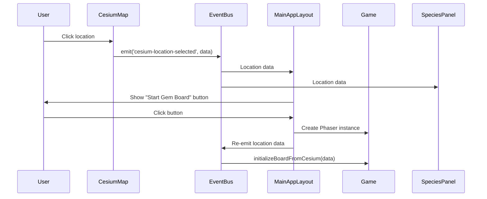
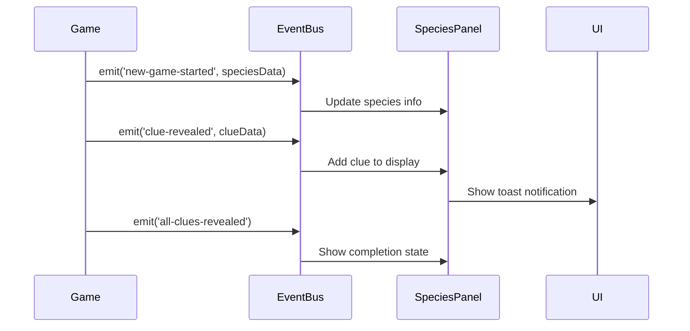

# EventBus and Display System Architecture Guide

## Overview

The Phaser-June project uses a hybrid React-Phaser architecture with an EventBus system for communication between the two frameworks. This guide explains how the EventBus works, the display system architecture, and how different components interact.

## Table of Contents

1. [EventBus Architecture](#eventbus-architecture)
2. [Display System Architecture](#display-system-architecture)
3. [Component Communication Flow](#component-communication-flow)
4. [Event Types and Payloads](#event-types-and-payloads)
5. [Key Components](#key-components)
6. [Common Patterns](#common-patterns)
7. [Debugging Tips](#debugging-tips)

## EventBus Architecture

### Core Implementation

**File**: `src/game/EventBus.ts`

The EventBus is a singleton instance that extends Phaser's EventEmitter with TypeScript type safety:

```typescript
class TypedEventBus extends Phaser.Events.EventEmitter {
  emit<K extends keyof EventPayloads>(event: K, ...args: [EventPayloads[K]]): boolean {
    return super.emit(event, ...args);
  }
  
  on<K extends keyof EventPayloads>(
    event: K,
    fn: (arg: EventPayloads[K]) => void,
    context?: any
  ): this {
    return super.on(event, fn, context);
  }
}

export const EventBus = new TypedEventBus();
```

### Why EventBus?

The EventBus solves a fundamental challenge in the hybrid architecture:
- **React** manages UI components, state, and layout
- **Phaser** manages the game canvas, game logic, and rendering
- They run in separate contexts and cannot directly access each other's state

The EventBus provides a decoupled communication channel between these two worlds.

## Display System Architecture

### Layout Structure

**File**: `src/MainAppLayout.tsx`

The display system consists of three main areas:

```
┌─────────────────────────────────┐
│                                 │
│      Top Section (60%)          │
│   (Cesium Map → Phaser Game)    │
│                                 │
├─────────────────────────────────┤
│                                 │
│     Bottom Section (40%)        │
│      (Species Panel)            │
│                                 │
└─────────────────────────────────┘
```

### Component Hierarchy

```
MainAppLayout
├── Top Section
│   ├── CesiumMap (initial state)
│   └── PhaserGame (after game start)
└── Bottom Section
    └── SpeciesPanel
        ├── SpeciesHeaderCard
        ├── DenseClueGrid
        └── ClueSheet
```

## Component Communication Flow

### 1. Location Selection Flow



### 2. Game Progress Flow



## Event Types and Payloads

### Defined Events

**File**: `src/game/EventBus.ts`

```typescript
export interface EventPayloads {
  'current-scene-ready': Phaser.Scene;
  
  'cesium-location-selected': {
    lon: number;
    lat: number;
    habitats: string[];
    species: Species[];
    rasterHabitats: RasterHabitatResult[];
  };
  
  'game-score-updated': {
    score: number;
    movesRemaining: number;
  };
  
  'game-over': {
    finalScore: number;
    habitats: string[];
  };
  
  'clue-revealed': CluePayload;
  
  'new-game-started': {
    speciesName: string;
    speciesId: number;
    totalSpecies: number;
    currentIndex: number;
    hiddenSpeciesName?: string;  // The real species name (hidden from player)
  };
  
  'game-reset': undefined;
  'no-species-found': {};
  
  'all-clues-revealed': {
    speciesId: number;
  };
  
  'all-species-completed': {
    totalSpecies: number;
  };
  
  'species-guess-submitted': {
    guessedName: string;
    speciesId: number;
    isCorrect: boolean;
    actualName: string;
  };
}
```

### Event Usage Examples

#### Emitting Events

```typescript
// From Phaser (Game.ts)
EventBus.emit('clue-revealed', {
    category: clueCategory,
    clue: clueText,
    name: clueConfig.categories[clueCategory].displayName,
    color: gemColor,
    icon: clueConfig.categories[clueCategory].icon
});

// From React (CesiumMap.tsx)
EventBus.emit('cesium-location-selected', {
    lon: longitude,
    lat: latitude,
    habitats: habitatList,
    species: speciesResult.species,
    rasterHabitats: rasterHabitats
});
```

#### Listening to Events

```typescript
// In React component (SpeciesPanel.tsx)
useEffect(() => {
    const handleClueRevealed = (clueData: CluePayload) => {
        setClues(prev => [...prev, clueData]);
        showClueToast(clueData);
    };
    
    EventBus.on('clue-revealed', handleClueRevealed);
    
    return () => {
        EventBus.off('clue-revealed', handleClueRevealed);
    };
}, []);

// In Phaser scene (Game.ts)
create() {
    EventBus.on('cesium-location-selected', this.initializeBoardFromCesium, this);
    EventBus.on('species-guess-submitted', this.handleSpeciesGuess, this);
}

shutdown() {
    EventBus.off('cesium-location-selected', this.initializeBoardFromCesium, this);
    EventBus.off('species-guess-submitted', this.handleSpeciesGuess, this);
}

// Species guess flow example
// From React (SpeciesGuessSelector.tsx)
EventBus.emit('species-guess-submitted', {
    guessedName: selectedSpecies,
    speciesId: speciesId,
    isCorrect: correct,
    actualName: hiddenSpeciesName
});
```

## Key Components

### 1. MainAppLayout.tsx

- **Purpose**: Orchestrates the overall layout and component mounting
- **Key Responsibilities**:
  - Manages game started state
  - Controls which component shows in top section
  - Handles transition from map to game

### 2. CesiumMap.tsx

- **Purpose**: 3D globe for location selection
- **EventBus Interactions**:
  - Emits: `cesium-location-selected`
  - Listens: None

### 3. Game.ts (Phaser Scene)

- **Purpose**: Main game logic and board management
- **EventBus Interactions**:
  - Emits: `new-game-started`, `clue-revealed`, `all-clues-revealed`, `game-score-updated`, `game-over`
  - Listens: `cesium-location-selected`

### 4. SpeciesPanel.tsx

- **Purpose**: Displays species information and clues
- **EventBus Interactions**:
  - Emits: None
  - Listens: `clue-revealed`, `new-game-started`, `game-reset`, `no-species-found`, `all-clues-revealed`, `all-species-completed`

## Common Patterns

### 1. Component Mounting Strategy

To ensure event listeners work properly, components that need to receive events must remain mounted:

```typescript
// Good: Using CSS to show/hide
<div style={{ display: showMap ? 'block' : 'none' }}>
    <CesiumMap />
</div>
<div style={{ display: showMap ? 'none' : 'block' }}>
    <SpeciesPanel />
</div>

// Bad: Conditional rendering (loses event listeners)
{showMap ? <CesiumMap /> : <SpeciesPanel />}
```

### 2. Event Cleanup

Always remove event listeners in cleanup functions:

```typescript
useEffect(() => {
    const handler = (data) => { /* ... */ };
    EventBus.on('event-name', handler);
    
    return () => {
        EventBus.off('event-name', handler);
    };
}, []);
```

### 3. Delayed Event Emission

When components need time to initialize:

```typescript
setTimeout(() => {
    EventBus.emit('event-name', data);
}, 100); // Give DOM/Phaser time to update
```

### 4. Type Safety

Always define event payloads in the EventPayloads interface:

```typescript
// In EventBus.ts
export interface EventPayloads {
    'my-new-event': {
        data: string;
        count: number;
    };
}

// Usage gets type checking
EventBus.emit('my-new-event', { data: 'test', count: 5 });
```

## Debugging Tips

### 1. Console Logging

Add strategic console logs to trace event flow:

```typescript
// Log when emitting
console.log('CesiumMap: Emitting location-selected', data);
EventBus.emit('cesium-location-selected', data);

// Log when receiving
const handler = (data) => {
    console.log('SpeciesPanel: Received event', data);
    // ... handle event
};
```

### 2. EventBus Inspector

Create a debug helper to log all events:

```typescript
// Add to development builds
if (process.env.NODE_ENV === 'development') {
    const originalEmit = EventBus.emit.bind(EventBus);
    EventBus.emit = function(event, ...args) {
        console.log(`[EventBus] ${event}`, ...args);
        return originalEmit(event, ...args);
    };
}
```

### 3. Component Mount Status

Verify components are mounted when events fire:

```typescript
useEffect(() => {
    console.log('Component mounted, setting up listeners');
    return () => {
        console.log('Component unmounting, removing listeners');
    };
}, []);
```

### 4. Common Issues

1. **"Cannot read properties of null"**: Usually means a component wasn't mounted when an event was emitted
2. **Events not received**: Check if the component is conditionally rendered (unmounted)
3. **Duplicate events**: Ensure cleanup functions are removing listeners
4. **Wrong data in events**: Verify the event payload matches the TypeScript interface

## Best Practices

1. **Keep Events Focused**: Each event should have a single, clear purpose
2. **Document Event Flow**: Add comments explaining what triggers each event
3. **Use Type Safety**: Always define payloads in EventPayloads interface
4. **Clean Up Listeners**: Prevent memory leaks with proper cleanup
5. **Avoid Event Chains**: Don't emit events from event handlers (can cause loops)
6. **Test Event Flow**: Use console logs during development to verify flow

## Architecture Benefits

1. **Decoupling**: React and Phaser remain independent
2. **Flexibility**: Easy to add new features without tight coupling
3. **Debugging**: Clear event flow makes issues easier to trace
4. **Type Safety**: TypeScript ensures correct event usage
5. **Scalability**: New components can easily tap into existing events

## Future Considerations

1. **Event Namespacing**: Consider prefixing events by source (e.g., 'game:', 'ui:')
2. **Event Middleware**: Add logging, validation, or transformation layers
3. **State Management**: Consider Redux/Zustand for complex state beyond events
4. **Performance**: Monitor event frequency for optimization opportunities