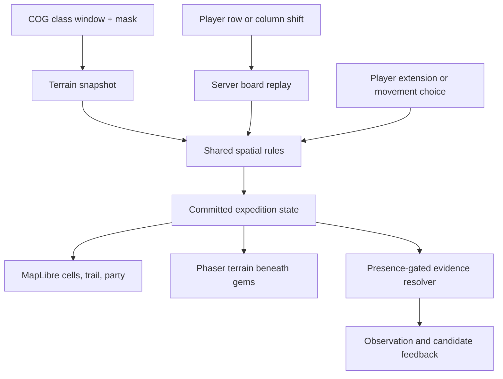

# 033 — COG board integration: review and prototype brief

Reviewed 2026-09-19 at `d0af36c2`. Status: DESIGN REVIEW; proposed direction, not an instruction to implement all phases. Source code unchanged. Scope: the pasted Ink/Speak proposals, current board/evidence contracts, and existing COG/map integration.

Revised after Grok's current-runtime review: **A is the next implementation scope. B and C remain deferred design proposals.** Resolve A's extraction and fixture prerequisites before its rendering work.

## Recommendation

Use the habitat COG to construct a geographically anchored terrain grid beneath the match-3 gems. MapLibre and Phaser display the same grid, trail, and party state. Matching changes access through that landscape; reaching an authored survey encounter establishes an in-game presence record; later matching can analyze that record through the existing server evidence pipeline.

The geographic integration is valuable. The pasted July critique is not a reliable description of today's runtime. Build on v4 and prove terrain alignment before changing evidence acquisition.

## Verified findings

Effort: S = hours, M = roughly a day, L = multiple days; estimates include verification. All code findings below are high confidence; gameplay outcomes require playtests.

| Priority | Finding and impact | Evidence | Effort / change risk |
|---|---|---|---|
| P0 | Historical contracts would send implementation backward. Current runtime uses five evidence families, six moves/site, v4 cases, and row/column shifts. | `src/expedition/evidenceFamilies.ts:3`; `src/lib/runCaseState.ts:90`; `src/lib/evidenceMoveVerification.ts:63`; `src/game/MoveAction.ts:3` | S to reconcile; high risk if ignored |
| P0 | Habitat percentages cannot locate a river or forest cell. Current COG use supplies regional histograms and rendered raster tiles, not a gameplay grid. | `src/lib/speciesService.ts:232`; `src/lib/maplibreLayers.ts:28`; `src/lib/nodeScoring.ts:369` | M extraction spike; medium risk |
| P0 | Existing BoardCell state moves with gems. Geography attached to it would slide around the world. | `src/game/boardTypes.ts:4`; `src/game/BackendPuzzle.ts:393` | M separate grid; high risk if mixed into gem state |
| P0 | Client-only trail/presence rewards would bypass the existing replay contract. Moves already undergo server reconstruction, checkpoint comparison, and retry deduplication. | `src/lib/evidenceMoveVerification.ts:95`; `src/app/api/runs/[runId]/evidence-progress/route.ts:41` | L spatial replay/resume; high risk |
| P1 | Proposed diagnostic atoms and presence gates would replace today's five-card corpus and six-move evidence-choice gate. They are not a 50-line drip edit. | `src/lib/caseCompilerV3.ts:108`; `src/app/api/runs/[runId]/evidence-choice/route.ts:50` | L integrated evidence change; high risk |
| P1 | The HUD already shows candidate elimination. Charge totals currently explain which families become selectable; hiding them without replacing that explanation obscures a real decision. | `src/MainAppLayout.tsx:222`; `src/components/CandidateRoster.tsx:45`; `src/expedition/evidenceFamilies.ts:66` | S feedback polish; medium risk if offers become opaque |

## Corrections to the pasted review

- **Drip:** `Game.ts` no longer implements `field-note-dripped`. The reuse point is `evidence-move-resolved` → `ExpeditionContext` → `evidence-progress` → server replay and hint selection.
- **Gem meaning:** Relatives, Body, Behavior, Habits, Place are shipped. Plan 018 superseded the method-verb design. Keep these for this prototype; renaming them is a separate design choice.
- **Budget:** six legal moves per site; not four energy with free 4+ matches. A new traversal mode must explicitly reconcile its budget with that server gate.
- **Input:** the game shifts wrapping rows/columns. “Player swap” and “conventional match-3” conceal a control change. Preserve current controls while testing geography.
- **Cascades:** direct matches supply family evidence. Cascades can spawn a Field Signal and emit flavor text; they cannot directly earn family evidence or a signal payout. Current direct moves can produce multiple hints; a one-Speak cap would be new.
- **Compiler:** five reviewed cards per species, with 3–5 weaker hints per family. Three selected families yield three observations. The old three-positive-elimination chain, signature fallback, and 7–10-card calculation no longer govern runtime.
- **Interpretation:** prediction was removed by the family redesign. Visible automatic candidate elimination already exists. Do not resurrect prediction just to supply visible feedback.
- **Overlap:** the current prototype-six pool uses a soft GIS prior; it does not prove all six candidates inhabit every selected clip. Six locally overlapping birds would require a reviewed local content pool.

## Live COG check

A read-only request to the configured TiTiler `/cog/info` returned HTTP 200 on 2026-09-19:

| Property | Observed value |
|---|---|
| CRS | EPSG:3857 |
| Raster dimensions | 388,996 × 388,996 |
| Bands / data type | 1 / uint16 |
| NoData | 0 |
| Projected bounds | approximately ±20,037,508.343 on both axes |
| Overviews | 2 through 1024, powers of two |

Bounds divided by dimensions imply approximately **103.02 projected metres/pixel**. Six source pixels span approximately 618.13 projected metres. This is nominal raster spacing, not a verified ground-resolution claim: ground distance varies with latitude, and the full affine transform/source provenance still need checking. Do not advertise a universal “100 m cell.”

The request confirms metadata only. Numeric-window decoding, class labels, overview resampling, local river coverage, and site suitability were not live-tested.

**Zero means missing data.** Both the migration doc's “water filtering: code 0” wording and `STATIC_HABITAT_CODE_TO_LABEL[0] = "Water"` (`src/lib/speciesService.ts:16`) conflict with the actual metadata. Existing histograms skip zero and tiles specify `nodata=0`; a new grid must also enforce the mask before looking up labels. Never generate a river, ocean, or walkable ground from missing pixels. Reconcile valid-code labels among this static lookup, database `habitat_colormap`, and deployed TiTiler `habitat_custom`; the deployed colormap definition is not in this repo. A label or color never overrides the validity mask.

TiTiler documents bounded raster extraction and raw `.tif`/`.npy` outputs. Use class values and a validity mask, with nearest sampling for the initial categorical grid. Verify the deployed endpoint before choosing a decoder; the repo currently has no direct GeoTIFF decoder dependency. Sources: [COG endpoints](https://developmentseed.org/titiler/endpoints/cog/), [raw output formats](https://developmentseed.org/titiler/user_guide/output_format/).

## Proposed shared world contract

Keep three distinct kinds of state:

1. **Immutable terrain snapshot:** dataset revision/content identity, source band, CRS, transform, clipped bounds, grid origin/dimensions, source pixel stride, habitat codes and valid-data mask. Class mapping has its own version. Same snapshot always produces the same cell footprints.
2. **Mutable expedition geography:** inked cells, open crossing edges, party cell, reached survey encounters, presence records, pending extension choice, and revision/last committed action. Persist independently of gem identity.
3. **Puzzle checkpoint:** existing gem grid, RNG state, score, move count, and Field Signal state.

Each terrain cell has a stable world id. For a north-up raster, source column/row plus dataset revision is sufficient for the first fixed clip. A renderer maps that id to board `[x][y]` and map polygon coordinates. Verify array orientation explicitly: the existing puzzle is column-major.

Map zoom, pitch, CSS size, gem falls, row wrapping, and shuffling must never change world coordinates. **Geographic adjacency does not wrap**, even though puzzle rows do. Terrain and trail survive gem clears, refill, viewport changes, and resume.

The COG defines habitat context. Traversability is an explicit game mapping layered on it. A habitat code does not establish slope, water depth, a safe ford, or animal presence. Add other sourced GIS layers only when they resolve a demonstrated need. An authored crossing socket is a game encounter, not a measured safe crossing.

Start with a fixed 6×6 clip at one current research site. Draw its footprint on the regional expedition map and provide a local map view of the same cells. Regional site-to-site travel remains a separate scale. A moving board viewport over a larger world is a later milestone, not a prerequisite for proving COG alignment.

## Recommended prototype sequence

### A. COG → fixed board → matching map footprint

Purpose: establish that board terrain actually comes from the selected geography.

- Record one authored fixture longitude/latitude, extracted values/mask, source revision, and chosen source window. Add an asymmetric synthetic raster fixture with known classes and missing pixels for orientation and masking tests. Current sites are generated from map clicks; an appropriate local clip has not yet been selected or verified. An unused database sampling schema is not an existing terrain grid.
- Read a bounded raw window from the configured COG server-side; convert it once into a small JSON terrain snapshot. Retain class codes, mask, source identity, and spatial transform. Do not read rendered RGB colors or infer positions from histogram percentages.
- Transform click coordinates to EPSG:3857, invert the verified source affine transform, snap to integer source-pixel boundaries, and derive the requested bounds from those boundaries. A `6x6` output size alone does not imply six original pixels. Specify input/output CRS explicitly, verify row orientation and pixel centres, and check the deployed service's actual values against the fixture.
- Start with native or integer-stride source sampling. For larger stride, document whether a cell is represented by a centre sample or categorical aggregation; do not claim nearest sampling gives a majority habitat. Inspect class diversity before choosing that stride. Do not manufacture a river when the clip lacks one. No per-cell network requests or raster requests per move.
- Use the existing habitat-code label mapping (`src/app/api/habitat/colormap/route.ts`) only after the mask and lookup reconciliation described above. Missing/unmapped codes remain explicitly unknown; zero can never take the static Water label.
- Render fixed habitat cells underneath the existing 6×6 puzzle in `BoardView`. Add a local camera mode fitted to that same clip, with zoom sufficient to pick each cell; the existing `ExpeditionMapHud` caps of 10 in-panel and 13 fullscreen are inadequate (`src/components/ExpeditionMapHud.tsx:31`). The regional camera shows a locator footprint and retains the three separate regional sites. One mounted map with explicit local/regional camera modes is sufficient; adding GeoJSON under the current zoom clamps is not. Selecting a local cell highlights its board counterpart and habitat label.
- Retain the current gem pool and movement rules. Habitat-specific color bias is optional later; it is not sufficient geographic integration by itself.
- Freeze the snapshot and source identity at run creation, before accepting board moves. A subsequent COG revision must not silently change an active run. Handle fetch failure explicitly; do not quietly substitute random “real” terrain.

Likely implementation touchpoints: new `src/expedition/terrainGrid.ts` and `src/lib/terrainSnapshot.server.ts`; run creation/projection; `src/game/BoardView.ts`; `src/game/EventBus.ts`; `src/contexts/ExpeditionContext.tsx`; `src/components/ExpeditionMapHud.tsx`. Keep terrain out of the movable `BoardCell.state`.

Acceptance: the deployed numeric extraction/decoder reproduces the recorded fixture; synthetic missing pixels never become Water; 36 cells agree between local map and board, including corner labels/orientation. All cells can be picked at supported viewport sizes. Local/regional camera switching preserves the regional route and clip footprint. Shifts, gravity, resize, map zoom, and reload preserve cell identities. A run keeps its original snapshot when the source changes.

### B. Deliberate route building on that clip

Purpose: prove geographic decisions before coupling them to deduction.

Deferred. Before a B playtest, explicitly decide whether existing evidence continues or the test uses an isolated routing harness with evidence issuance disabled. Current moves already grant hints from move one; B is not automatically an evidence-free experiment. Do not mute production evidence as an incidental traversal change.

- Use one suitable recorded COG clip plus a clearly authored camp, crossing socket, and far-bank survey encounter. Keep a synthetic fixture for deterministic rule tests.
- Ink matched ground cells. Store disconnected ink, but only the camp-connected traversable component enables travel. Water/barrier rules apply to traversal edges; do not remove gems over water or rewrite gravity for the first test.
- Proposed Variant B: one **direct** 4+ match grants one immediate extension choice on the current reachable trail frontier. It is not restricted to the lucky match's exact location. A 5+ or several qualifying groups still grant one choice. At the designated crossing, this choice can activate the far-bank connection under the authored crossing rule.
- Cascades may ink their matched cells; they grant no extension choice or diagnostic observation. Keep their influence visible in the route result.
- Player selects a reachable destination for the party. Mere viewport visibility, detached ink, or a cursor over the site does not establish arrival. Reaching the survey encounter records arrival once.
- Persist pending choices. Disable the next board move until an extension is selected or explicitly skipped; if no frontier cell is legal, resolve that condition deterministically.
- Reuse board replay and transactional retry handling. Replay already records direct `[x,y]` in `directEvidenceCells` then reduces them to family counts (`src/lib/evidenceMoveVerification.ts:150`, `:218`); retain verified spatial deltas, including separate cascade coordinates if cascades ink. Map slots to frozen terrain ids. Persist ink, party and pending choice outside gem state and transient HUD feeds (`ExpeditionContext` rebuilds `hintFeed` empty on resume). Validate extension adjacency and party movement server-side; do not accept client assertions that a site was reached. A separate extension command is appropriate because the player chooses after seeing the move result.

Budget decision: keep six moves for the first routing measurement, count every legal move, and measure direct 4+ frequency as well as whether the fixture can be traversed deliberately. Frequency and reachability are currently unmeasured. If the fixture fails, record that failure and tune/re-spec the slice before integration. Do not silently restore free moves or add a second resource. Authored sockets determine the crossing rule; this prototype does not demonstrate that the COG itself generated a traversable path.

Acceptance: automated fixed-seed routes reach the encounter within the declared budget; illegal edge wraps, detached trails, forged arrivals, repeated rewards, and stale extension commands fail. Manual playtest records success rate and move count separately from whether players understand the route. Agree the human success threshold before claiming the prototype passes.

### C. Arrival → analyze an existing family observation

Purpose: integrate the scientific and spatial loops without multiplying the corpus.

- Create a presence record when the party reaches the authored encounter. Store encounter id, location, source, and acquired action/revision. Label it as case fiction supported by authored evidence, not a real-world wildlife sighting generated from the raster.
- Before arrival, allow public habitat context and explicitly sourced kit material. Do not expose target-specific analysis merely because a site is visible. A generic “weak camp atom” must not become an unlimited hint channel.
- Apply the presence requirement to all relevant acquisition channels, including direct family hints and Field Signal payouts. Keep generic cascade flavor separate. Preserve already-earned records on resume.
- Reuse one reviewed family card as the diagnostic unit. Existing soft hints can represent analysis of that record; they are not three new independent facts whose conjunction has been validated. Defer the “three atoms fill a Holo slot” economy and any new card cardinality.
- Define an explicit versioned replacement for the current six-move → family-choice → node-advance gate. Arrival on the sixth move leaves no later move to analyze: `src/game/scenes/Game.ts:240` does not re-enable input, `src/lib/evidenceMoveVerification.ts:63` rejects move seven, `src/expedition/caseFlow.ts:52` selects `choose_evidence`, and `src/app/api/runs/[runId]/evidence-choice/route.ts:50` requires six moves. Reconcile those gates together before C implementation. Do not hide the transition in a scene callback. A complete multi-site redesign requires its own reviewed plan.
- Keep availability, costs, and budgets determined by public game state. Resolve secret content on the server. Server resolution alone does not conceal answer-dependent exhaustion: repeated text, silence, and changing candidate states remain observable. Test across all candidate answers using the same public actions. This is a constraint on C, not a demonstrated exhaustion bug in today's runtime: direct matches receive hints, and elimination occurs at family choice.
- Show the latest observation glyph, short label, source/site, and trail change on the existing HUD. Apply candidate dimming only when earned evidence actually supports elimination. A soft hint need not eliminate anyone.
- Keep offer eligibility legible while charge-based offers exist. Removing numeric wallets is a product decision coupled to replacing the offer rule, not a harmless label swap.

Acceptance: camp-only matching cannot earn the gated observation; seeing a site cannot substitute for arrival; arrival/retry awards once; later eligible analysis updates the existing evidence log and roster with a defensible reason. “Exactly two dim” is a fixture choice, not a universal corpus invariant.

## Verification and boundaries

Existing verification commands, confirmed in `package.json`:

| Gate | Command | Expected result |
|---|---|---|
| TypeScript | `npm run typecheck` | exit 0 |
| Offline regression suite | `npm test` | all tests pass |
| Production compilation after integration | `npm run build` | exit 0 |
| Corpus, only if evidence semantics change | `npm run verify:case-compiler` | reviewed corpus and all family paths accepted; requires DB environment |

Add behavioral tests using the existing `node:test` structure in `tests/lib/evidenceMoveVerification.test.ts`: raster orientation and mask, stable terrain through gem movement, geographic adjacency without wrapping, traversal and replay, resume during extension, duplicate commands, and presence-gated rewards. These are implementation gates, not tests run during this review.

This review adds this brief and its plan-index entry. No game code, data, dependencies, processes, or existing implementation plans were changed. The supplied proposals have no standalone files to patch; this brief records their corrected direction. Source changes should follow a separately scoped implementation task, beginning with A.

Before A rendering work, resolve and record: (1) deployed numeric extraction plus decoding, (2) source-pixel-aligned EPSG:3857 window, (3) zero/mask precedence and valid-code lookup reconciliation, (4) authored coordinate plus synthetic raster fixture, (5) snapshot identity frozen at run creation, (6) local camera and regional locator behavior, (7) terrain storage outside `BoardCell.state`. A scoped extraction spike supplies the missing evidence; this review does not claim it has passed. B/C remain deferred. Before C, resolve the move-budget/arrival/analysis transition and resulting family-choice semantics. Do not solve those gaps by adding undocumented fallbacks.

Out of this review: broad security/dependency audit, live database contents, UI/browser playtest, complete raster provenance validation, production performance, and persistent scrolling-world implementation. No full test suite was run for this documentation-only review.

Incidental legacy-reference flag: `.gitignore` still lists `supabase_nextjs.txt`; remove that obsolete reference in a separate cleanup. Historical plan 013 and the old board integration spec should remain recognizable as historical; they are not current execution contracts.
