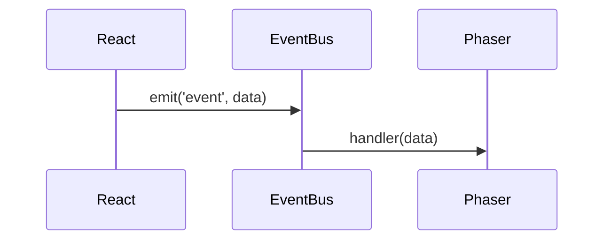

# Documentation Contribution Guide

Standards, conventions, and best practices for contributing to the Phaser-June documentation. Follow these guidelines to maintain consistency and quality.

---

## 1. Diátaxis Framework

All documentation must fit into one of four categories. **Do not mix categories within a single document.**

| Category | Purpose | Tone | Example |
|----------|---------|------|---------|
| **Tutorial** | Learning-oriented lesson | Encouraging, hand-holding | "Your First Phaser Scene" |
| **How-To Guide** | Task-oriented recipe | Direct, step-by-step | "How to Add a New Clue Category" |
| **Explanation** | Understanding-oriented | Discursive, conceptual | "EventBus Architecture" |
| **Reference** | Information-oriented | Dry, factual, exhaustive | "Event Types Reference" |

### Category Placement

```
docs/
├── tutorials/      # Learning paths (Tutorial)
├── guides/         # Task recipes (How-To)
├── architecture/   # Big-picture concepts (Explanation)
└── reference/      # Lookup tables (Reference)
```

### Category Indicators

Add a frontmatter tag indicating the type:

```yaml
---
tags: [tutorial, phaser, beginner]  # or [guide, ...], [architecture, ...], [reference, ...]
---
```

---

## 2. Document Structure

### Required Frontmatter

Every `.md` file MUST have:

```yaml
---
sidebar_position: 1          # Order in sidebar (lower = higher)
title: Human-Readable Title  # Displayed in sidebar and page
description: One-line summary for SEO and link previews
tags: [category, topic, difficulty]
---
```

### Optional Frontmatter

```yaml
---
difficulty: Beginner | Intermediate | Advanced
---
```

### Heading Hierarchy

```markdown
# Page Title (H1) - Only ONE per document

## Major Section (H2)

### Subsection (H3)

#### Minor heading (H4) - Use sparingly
```

**Rules:**
- Never skip heading levels (no H1 → H3)
- H1 should match the `title` in frontmatter
- Use sentence case for headings ("Event types reference" not "Event Types Reference")

---

## 3. Naming Conventions

### File Names

Use **kebab-case** with category prefix when helpful:

```
# Good
clue-board.md
react-phaser-bridge.md
database-schema.md

# Avoid
ClueBoard.md
react_phaser_bridge.md
DATABASE_SCHEMA.md
```

### Internal Links

Use relative paths from `/docs/`:

```markdown
<!-- Good -->
[EventBus Architecture](/docs/architecture/eventbus-display)
[Database Schema](/docs/reference/database-schema)

<!-- Avoid -->
[Link](../architecture/eventbus-display.md)
[Link](https://full-url.com/docs/...)
```

---

## 4. Code Blocks

### Language Tags

Always specify the language:

````markdown
```typescript
const x = 1;
```

```bash
npm run dev
```

```sql
SELECT * FROM icaa_view;
```
````

### Code Block Titles

Use comments or Docusaurus title syntax for context:

````markdown
```typescript
// src/game/scenes/Game.ts
class Game extends Phaser.Scene { ... }
```
````

### Inline Code

Use backticks for:
- File names: `Game.ts`
- Function names: `handleResize()`
- Variables: `gemSize`
- Commands: `npm run build`
- Types: `Species[]`

---

## 5. Tables

### Standard Format

```markdown
| Column 1 | Column 2 | Column 3 |
|----------|----------|----------|
| Data     | Data     | Data     |
```

### Rules

- Always include header row
- Align pipes for readability
- Keep cells concise (< 50 chars)
- **Escape curly braces** in tables: use `(x, y)` not curly braces (MDX interprets them as JSX)

---

## 6. Admonitions

Use Docusaurus admonitions for callouts:

```markdown
:::note
General information or context.
:::

:::tip
Helpful advice or best practice.
:::

:::warning
Potential pitfall or important caveat.
:::

:::danger
Critical information that could cause errors.
:::

:::info
Background information.
:::
```

**When to use:**
- `note` - Clarifying context
- `tip` - Best practices, shortcuts
- `warning` - Common mistakes, gotchas
- `danger` - Security issues, data loss risks
- `info` - Background knowledge

---

## 7. Diagrams

### Mermaid (Preferred)

Use Mermaid for sequence diagrams and flowcharts:

````markdown

````

**Rules:**
- Keep under 8 steps for readability
- Label all participants
- Show event names and payload shapes

### ASCII Diagrams

For simple layouts, use code blocks:

````markdown
```
┌─────────────┐
│   React     │
├─────────────┤
│  EventBus   │
├─────────────┤
│   Phaser    │
└─────────────┘
```
````

---

## 8. TSDoc Comments (For TypeDoc API)

TypeDoc generates API reference from inline comments. Follow these standards:

### Function Documentation

```typescript
/**
 * Calculates the pixel position for a gem at grid coordinates.
 *
 * @param gridX - The x-coordinate in grid units (0 to GRID_COLS-1)
 * @param gridY - The y-coordinate in grid units (0 to GRID_ROWS-1)
 * @returns Object with x and y pixel positions
 *
 * @example
 * ```typescript
 * const pos = getSpritePosition(3, 4);
 * console.log(pos.x, pos.y); // 256, 320
 * ```
 */
private getSpritePosition(gridX: number, gridY: number): { x: number; y: number } {
  // ...
}
```

### Interface Documentation

```typescript
/**
 * Payload emitted when a clue is revealed through gem matching.
 *
 * @remarks
 * This event is emitted by Game.ts and consumed by SpeciesPanel.tsx.
 * The category number maps to GemCategory enum values.
 */
export interface CluePayload {
  /** The clue category (0-7), maps to GemCategory enum */
  category: number;

  /** Display name for the category (e.g., "Classification") */
  heading: string;

  /** The actual clue text shown to the player */
  clue: string;

  /** Database ID of the current species */
  speciesId: number;
}
```

### Enum Documentation

```typescript
/**
 * Categories of clues revealed by matching different gem colors.
 *
 * @remarks
 * Each category corresponds to a gem color and pulls from specific
 * database fields. See reference/gem-clue-mapping for full mapping.
 */
export enum GemCategory {
  /** Red gems - Taxonomic classification (phylum → species) */
  CLASSIFICATION = 0,

  /** Green gems - Habitat from Cesium raster data */
  HABITAT = 1,

  // ...
}
```

### TSDoc Tags Reference

| Tag | Usage |
|-----|-------|
| `@param name` | Document function parameters |
| `@returns` | Document return value |
| `@example` | Provide usage example |
| `@remarks` | Additional context |
| `@see` | Link to related docs |
| `@deprecated` | Mark as deprecated with reason |
| `@internal` | Exclude from public API docs |
| `@throws` | Document exceptions |

---

## 9. Writing Style

### Voice and Tone

- **Active voice:** "The EventBus emits events" not "Events are emitted by the EventBus"
- **Second person:** "You can configure..." not "One can configure..."
- **Present tense:** "This function returns..." not "This function will return..."
- **Direct:** Omit filler words ("In order to" → "To")

### Technical Accuracy

- Verify code examples compile/run
- Include file paths for code references
- Update examples when code changes
- Link to source files when helpful

### Brevity

- Keep sentences under 25 words
- One concept per paragraph
- Use lists for 3+ items
- Prefer tables for comparisons

---

## 10. Cross-Referencing

### Link to Related Docs

End each document with a "Related Documentation" section:

```markdown
## Related Documentation

- [EventBus Architecture](/docs/architecture/eventbus-display)
- [Clue Board Guide](/docs/guides/game/clue-board)
```

### Link to Source Code

Reference actual file locations:

```markdown
**Location:** `src/game/scenes/Game.ts`
```

### Link to External Resources

Use descriptive link text:

```markdown
<!-- Good -->
See the [Phaser 3 documentation](https://phaser.io/docs)

<!-- Avoid -->
See [here](https://phaser.io/docs)
```

---

## 11. Tutorials Checklist

Tutorials MUST include:

- [ ] **Prerequisites:** What the reader should know/have
- [ ] **Learning objectives:** What they'll learn (3-5 bullets)
- [ ] **Step-by-step instructions:** Numbered, actionable steps
- [ ] **Checkpoints:** "You should now see..." after major steps
- [ ] **Code examples:** Copy-pasteable, tested code
- [ ] **Expected output:** Screenshots or console output
- [ ] **Exercises (optional):** 1-2 challenges to reinforce learning
- [ ] **Next steps:** Links to follow-up tutorials/guides

---

## 12. Reference Docs Checklist

Reference docs MUST include:

- [ ] **Source of truth:** File path where data originates
- [ ] **Complete coverage:** All items in the category
- [ ] **Consistent format:** Same columns/structure throughout
- [ ] **Update instructions:** How to keep in sync with code
- [ ] **TypeScript types:** Link to or include type definitions
- [ ] **Examples:** At least one usage example per major item

---

## 13. Maintenance

### Keeping Docs Current

- Update docs in the same PR as code changes
- Run `npm run build` in `/wiki` to catch broken links
- Check TypeDoc output after modifying TSDoc comments

### Versioning

- Document breaking changes prominently
- Use admonitions for version-specific info:

```markdown
:::warning Version Note
This API changed in v2.0. See migration guide.
:::
```

### Review Checklist

Before merging documentation changes:

- [ ] Frontmatter complete (title, description, tags)
- [ ] Heading hierarchy correct (no skipped levels)
- [ ] Code blocks have language tags
- [ ] All links work (`npm run build` passes)
- [ ] No curly braces in table cells
- [ ] Fits single Diátaxis category
- [ ] Related docs section present

---

## Quick Reference Card

```
FRONTMATTER
  sidebar_position: N
  title: Title Case
  description: One line
  tags: [category, topic]

HEADINGS
  # H1 (one per doc)
  ## H2 (major sections)
  ### H3 (subsections)

CODE
  ```typescript (always tag language)
  // src/path/file.ts (include path)
  ```

LINKS
  [Text](/docs/category/tutorials)

TABLES
  | Col | Col |
  |-----|-----|
  | use (x,y) not curly braces |

ADMONITIONS
  :::note / :::tip / :::warning / :::danger

TSDOC
  /** @param name - description */
  /** @returns description */
  /** @example code */
```
