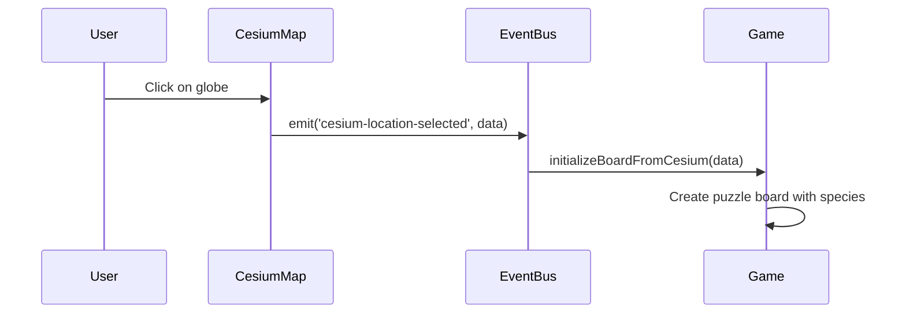
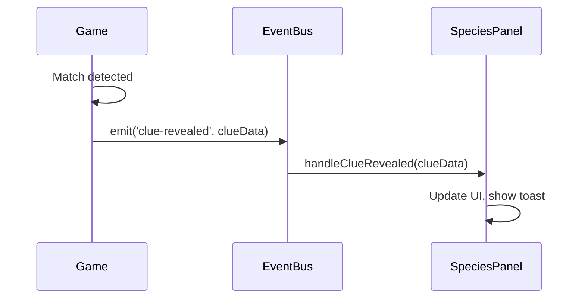

# EventBus and Display System Architecture

The Phaser-June project uses a **hybrid React-Phaser architecture** with an EventBus system for cross-framework communication. This guide explains the core patterns that make the application reactive.

## The Fundamental Challenge

React and Phaser operate in fundamentally different paradigms:

| Aspect | React | Phaser |
|--------|-------|--------|
| **Rendering** | Virtual DOM, declarative | Canvas, imperative |
| **State** | useState/useReducer | Scene properties |
| **Lifecycle** | Component mount/unmount | Scene create/update/shutdown |
| **Updates** | Re-render on state change | Game loop (60fps) |

They cannot directly access each other's state. The **EventBus** bridges this gap.

## EventBus Architecture

### Core Implementation

**Location:** `src/game/EventBus.ts`

```typescript
class TypedEventBus extends Phaser.Events.EventEmitter {
  emit<K extends keyof EventPayloads>(
    event: K,
    ...args: [EventPayloads[K]]
  ): boolean {
    return super.emit(event, ...args);
  }

  on<K extends keyof EventPayloads>(
    event: K,
    fn: (arg: EventPayloads[K]) => void,
    context?: any
  ): this {
    return super.on(event, fn, context);
  }
}

export const EventBus = new TypedEventBus();
```

The EventBus extends Phaser's EventEmitter with TypeScript generics, ensuring type safety for all event payloads.

### Event Type Definitions

```typescript
export interface EventPayloads {
  'current-scene-ready': Phaser.Scene;

  'cesium-location-selected': {
    lon: number;
    lat: number;
    habitats: string[];
    species: Species[];
    rasterHabitats: RasterHabitatResult[];
  };

  'clue-revealed': CluePayload;

  'new-game-started': {
    speciesName: string;
    speciesId: number;
    totalSpecies: number;
    currentIndex: number;
  };

  'species-guess-submitted': {
    guessedName: string;
    speciesId: number;
    isCorrect: boolean;
    actualName: string;
  };

  'all-species-completed': { totalSpecies: number };
  'game-reset': undefined;
}
```

## Display System Layout

### Component Hierarchy

```
MainAppLayout
├── Top Section (60% height)
│   ├── CesiumMap (before game start)
│   └── PhaserGame (after game start)
└── Bottom Section (40% height)
    └── SpeciesPanel
        ├── SpeciesHeaderCard
        ├── DenseClueGrid
        └── ClueSheet
```

### Layout Code

**Location:** `src/MainAppLayout.tsx`

```typescript
const appStyle: React.CSSProperties = {
  display: 'flex',
  flexDirection: 'column',
  width: '100vw',
  height: '100vh',
  overflow: 'hidden'
};

const cesiumContainerStyle: React.CSSProperties = {
  width: '100%',
  height: cesiumMinimized ? '0%' : '30%',
  transition: 'height 0.3s ease-in-out',
};
```

## Key Communication Flows

### 1. Location Selection (React → Phaser)



**CesiumMap.tsx:**
```typescript
EventBus.emit('cesium-location-selected', {
  lon: longitude,
  lat: latitude,
  habitats: habitatList,
  species: speciesResult.species,
  rasterHabitats: rasterHabitats
});
```

**Game.ts:**
```typescript
create() {
  EventBus.on('cesium-location-selected', this.initializeBoardFromCesium, this);
}
```

### 2. Clue Reveal (Phaser → React)



**Game.ts:**
```typescript
EventBus.emit('clue-revealed', {
  category: clueCategory,
  clue: clueText,
  name: clueConfig.categories[clueCategory].displayName,
  color: gemColor,
  icon: clueConfig.categories[clueCategory].icon
});
```

**SpeciesPanel.tsx:**
```typescript
useEffect(() => {
  const handleClueRevealed = (clueData: CluePayload) => {
    setClues(prev => [...prev, clueData]);
    showClueToast(clueData);
  };

  EventBus.on('clue-revealed', handleClueRevealed);

  return () => {
    EventBus.off('clue-revealed', handleClueRevealed);
  };
}, []);
```

## Critical Pattern: Component Mounting

:::warning Keep Components Mounted
Components that listen to EventBus events must remain in the DOM. Use CSS visibility instead of conditional rendering.
:::

**Correct:**
```tsx
<div style={{ display: showMap ? 'block' : 'none' }}>
  <CesiumMap />
</div>
```

**Incorrect:**
```tsx
{showMap && <CesiumMap />}  // Unmounts component, loses listeners!
```

## Event Cleanup

Always remove listeners in cleanup functions to prevent memory leaks:

```typescript
useEffect(() => {
  const handler = (data: PayloadType) => { /* ... */ };
  EventBus.on('event-name', handler);

  return () => {
    EventBus.off('event-name', handler);  // Critical!
  };
}, []);
```

In Phaser scenes:

```typescript
shutdown() {
  EventBus.off('cesium-location-selected', this.initializeBoardFromCesium, this);
  EventBus.off('layout-changed', this.handleLayoutChange, this);
}
```

## Adding New Events

1. **Define the payload type** in `EventPayloads` interface
2. **Emit from source** (React component or Phaser scene)
3. **Listen in target** (with proper cleanup)
4. **Document the flow** for future maintainers

```typescript
// 1. Define in EventBus.ts
export interface EventPayloads {
  'my-new-event': { data: string; count: number };
}

// 2. Emit
EventBus.emit('my-new-event', { data: 'test', count: 5 });

// 3. Listen
EventBus.on('my-new-event', (payload) => {
  console.log(payload.data, payload.count);  // TypeScript knows the types!
});
```

## Debugging Tips

### Log All Events

```typescript
if (process.env.NODE_ENV === 'development') {
  const originalEmit = EventBus.emit.bind(EventBus);
  EventBus.emit = function(event, ...args) {
    console.log(`[EventBus] ${event}`, ...args);
    return originalEmit(event, ...args);
  };
}
```

### Track Component Mount Status

```typescript
useEffect(() => {
  console.log('Component mounted, setting up listeners');
  return () => console.log('Component unmounting');
}, []);
```

## Related Documentation

- [Game Reactivity Guide](/docs/architecture/game-reactivity) - Resize handling and MVC pattern
- [UI Display System](/docs/architecture/ui-display-system) - Layout variables and responsive behavior
