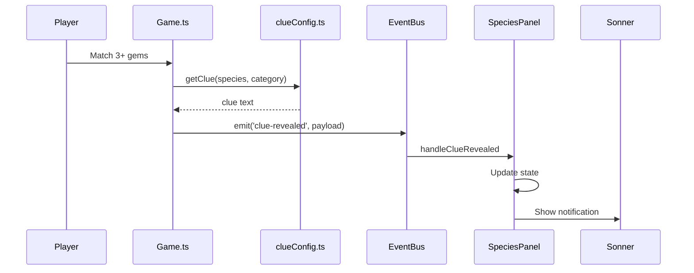

# Clue Board Implementation Guide

This guide explains how the match-3 puzzle board generates clues and communicates them to the React UI.

## Architecture Overview

The clue system follows a clean separation of concerns:

| Layer | Responsibility | Technology |
|-------|---------------|------------|
| Game Logic | Gem matching, clue generation | Phaser |
| EventBus | Cross-framework communication | Custom EventEmitter |
| UI Components | Clue display, notifications | React |
| Notifications | Real-time feedback | Sonner toasts |

## Component Structure

### Core Components

```
SpeciesPanel.tsx          # Main container, event orchestration
├── SpeciesHeaderCard.tsx # Species info, colored dot indicators
├── DenseClueGrid.tsx     # Compact clue list
└── ClueSheet.tsx         # Detailed slide-out panel
```

### Event Flow



## Clue Payload Structure

```typescript
interface CluePayload {
  category: GemCategory;    // Enum (0-7)
  heading: string;          // Category display name
  clue: string;             // The actual clue text
  speciesId: number;        // Current species ID
  name: string;             // Category name
  icon: string;             // Emoji icon
  color: string;            // Gem color for UI
}
```

## Color-Category Mapping

Each gem color corresponds to a clue category:

| Color | Category | Icon | Database Fields |
|-------|----------|------|-----------------|
| Red | Classification | 🧬 | `phylum`, `class`, `order_`, `family`, `genus`, `sci_name` |
| Green | Habitat (Raster) | 🌳 | Cesium raster data |
| Blue | Geographic | 🗺️ | `geo_desc`, `dist_comm`, `hab_desc` |
| Orange | Morphology | 🐆 | `pattern`, `color_prim`, `size_max`, `weight_kg` |
| Yellow | Behavior & Diet | 💨 | `behav_1`, `diet_type`, `diet_prey` |
| Black | Life Cycle | ⏳ | `life_desc1`, `lifespan`, `clutch_sz` |
| White | Conservation | 🛡️ | `cons_text`, `threats`, `cons_code` |
| Purple | Key Facts | 🔮 | `key_fact1`, `key_fact2`, `key_fact3` |

## Progressive Classification System

The Classification category (red gems) reveals clues progressively:

### Revelation Sequence

1. **1st Red Match:** `Phylum: CHORDATA`
2. **2nd Red Match:** `Class: REPTILIA`
3. **3rd Red Match:** `Order: TESTUDINES`
4. **4th Red Match:** `Family: EMYDIDAE`
5. **5th Red Match:** `Genus: Emydoidea`
6. **6th Red Match:** `Scientific name: Emydoidea blandingii`

### Implementation

```typescript
// src/game/clueConfig.ts
const CLASSIFICATION_SEQUENCE: Array<keyof Species> = [
  'phylum', 'class', 'order_', 'family', 'genus', 'sci_name'
];

// WeakMap for memory-efficient progress tracking
const classificationProgress = new WeakMap<Species, number>();

function getNextClassificationClue(species: Species): string {
  let progress = classificationProgress.get(species) ?? 0;

  while (progress < CLASSIFICATION_SEQUENCE.length) {
    const field = CLASSIFICATION_SEQUENCE[progress];
    const value = species[field];
    progress++;
    classificationProgress.set(species, progress);

    if (value) {
      return `${formatFieldName(field)}: ${value}`;
    }
    // Skip missing fields but count progress
  }

  return ''; // Sequence complete
}
```

### UI Handling for Progressive Clues

The SpeciesPanel allows multiple clues from Classification:

```typescript
// Before: Blocked all duplicate categories
if (prev.some(c => c.category === clueData.category)) return prev;

// After: Special handling for Classification
const isDuplicate = clueData.category === 0 ?
  prev.some(c => c.clue === clueData.clue) :  // Check text, not category
  prev.some(c => c.category === clueData.category);
```

## Adding a New Clue Category

### Step 1: Define the Category

```typescript
// src/game/clueConfig.ts
export enum GemCategory {
  CLASSIFICATION = 0,
  HABITAT = 1,
  // ... existing categories
  NEW_CATEGORY = 8,  // Add new enum value
}

export const CLUE_CONFIG = {
  categories: {
    [GemCategory.NEW_CATEGORY]: {
      displayName: 'New Category',
      icon: '✨',
      color: 'cyan',
      fields: ['new_field1', 'new_field2'],
    },
  },
};
```

### Step 2: Add Gem Type

```typescript
// src/game/constants.ts
export const GEM_TYPES = [
  'black', 'blue', 'green', 'orange',
  'red', 'white', 'yellow', 'purple',
  'cyan',  // Add new color
];
```

### Step 3: Map Gem to Category

```typescript
// src/game/scenes/Game.ts
private gemTypeToCategory: Record<string, GemCategory> = {
  'red': GemCategory.CLASSIFICATION,
  // ... existing mappings
  'cyan': GemCategory.NEW_CATEGORY,
};
```

### Step 4: Add Asset Files

Place in `public/assets/`:
- `cyan_gem_0.png` through `cyan_gem_7.png`

## State Management

### SpeciesPanel State

```typescript
const [clues, setClues] = useState<CluePayload[]>([]);
const [selectedSpeciesName, setSelectedSpeciesName] = useState('');
const [discoveredClues, setDiscoveredClues] = useState<Array<{
  name: string;
  color: string;
  icon: string;
}>>([]);
const [allCluesRevealed, setAllCluesRevealed] = useState(false);
```

### Event Listeners

```typescript
useEffect(() => {
  const handlers = {
    'clue-revealed': handleClueRevealed,
    'new-game-started': handleNewGame,
    'game-reset': handleReset,
    'all-clues-revealed': handleAllCluesRevealed,
    'all-species-completed': handleAllComplete,
  };

  Object.entries(handlers).forEach(([event, handler]) => {
    EventBus.on(event, handler);
  });

  return () => {
    Object.entries(handlers).forEach(([event, handler]) => {
      EventBus.off(event, handler);
    });
  };
}, []);
```

## User Experience Flow

1. **Initial State:** Empty grid with instructions
2. **Species Selection:** Player clicks map location
3. **Gem Matching:** Match reveals clue + toast notification
4. **Progress Tracking:** Colored dots show discovered categories
5. **Completion:** Auto-advance to next species

## Dependencies

| Package | Version | Purpose |
|---------|---------|---------|
| sonner | ^1.5.0 | Toast notifications |
| @radix-ui/react-dialog | - | Dialog components |
| @radix-ui/react-scroll-area | ^1.0.0 | Scroll areas |
| lucide-react | - | Icons |

## Related Documentation

- [EventBus Architecture](/docs/architecture/eventbus-display)
- [Species Discovery](/docs/guides/game/species-discovery)
- [Database Schema](/docs/reference/database-schema)
