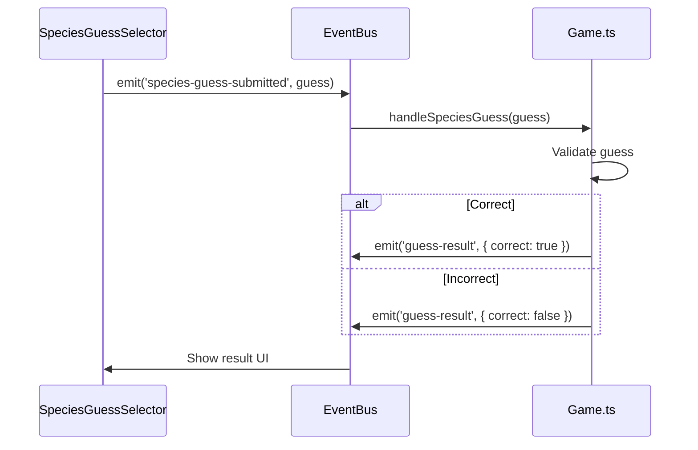

# Tutorial: React-Phaser Bridge

Learn how Critter Connect bridges React and Phaser through the EventBus pattern.

## The Challenge

React and Phaser operate in different worlds:

| React | Phaser |
|-------|--------|
| Declarative rendering | Imperative game loop |
| Virtual DOM | Canvas rendering |
| Component state | Scene properties |
| Hooks lifecycle | Scene lifecycle |

They cannot directly access each other. The EventBus solves this.

## How EventBus Works

**Location:** `src/game/EventBus.ts`

```typescript
import Phaser from 'phaser';

class TypedEventBus extends Phaser.Events.EventEmitter {
  emit<K extends keyof EventPayloads>(
    event: K,
    ...args: [EventPayloads[K]]
  ): boolean {
    return super.emit(event, ...args);
  }

  on<K extends keyof EventPayloads>(
    event: K,
    fn: (arg: EventPayloads[K]) => void,
    context?: any
  ): this {
    return super.on(event, fn, context);
  }
}

export const EventBus = new TypedEventBus();
```

It's a **typed pub/sub system** where:
- Any component can **publish** (emit) events
- Any component can **subscribe** (listen) to events
- TypeScript ensures payloads match expected types

## Pattern 1: React → Phaser

**Example:** Sending map selection to game

### React Side (CesiumMap.tsx)

```typescript
import { EventBus } from '@/game/EventBus';

const handleMapClick = (lon: number, lat: number, species: Species[]) => {
  EventBus.emit('cesium-location-selected', {
    lon,
    lat,
    species,
    habitats: [],
    rasterHabitats: []
  });
};
```

### Phaser Side (Game.ts)

```typescript
create() {
  EventBus.on('cesium-location-selected', this.initializeBoardFromCesium, this);
}

private initializeBoardFromCesium(data: {
  lon: number;
  lat: number;
  species: Species[];
}) {
  // Use the data to set up the game board
  this.selectedSpecies = data.species[0];
  this.createBoard();
}

shutdown() {
  EventBus.off('cesium-location-selected', this.initializeBoardFromCesium, this);
}
```

:::warning Context Binding
Always pass `this` as the third argument to `EventBus.on()` in Phaser scenes. This ensures `this` refers to the scene inside the handler.
:::

## Pattern 2: Phaser → React

**Example:** Sending clue discoveries to UI

### Phaser Side (Game.ts)

```typescript
private revealClue(category: GemCategory, clueText: string) {
  EventBus.emit('clue-revealed', {
    category,
    heading: CLUE_CONFIG.categories[category].displayName,
    clue: clueText,
    speciesId: this.selectedSpecies.id,
    name: CLUE_CONFIG.categories[category].displayName,
    icon: CLUE_CONFIG.categories[category].icon,
    color: this.categoryToColor(category)
  });
}
```

### React Side (SpeciesPanel.tsx)

```typescript
import { useEffect, useState } from 'react';
import { EventBus } from '@/game/EventBus';
import type { CluePayload } from '@/game/EventBus';

export function SpeciesPanel() {
  const [clues, setClues] = useState<CluePayload[]>([]);

  useEffect(() => {
    const handleClueRevealed = (clueData: CluePayload) => {
      setClues(prev => [...prev, clueData]);
    };

    EventBus.on('clue-revealed', handleClueRevealed);

    return () => {
      EventBus.off('clue-revealed', handleClueRevealed);
    };
  }, []);

  return (
    <div>
      {clues.map((clue, i) => (
        <div key={i}>{clue.clue}</div>
      ))}
    </div>
  );
}
```

:::tip useEffect Cleanup
Always return a cleanup function that removes the listener. This prevents memory leaks and duplicate handlers.
:::

## Pattern 3: Bidirectional Communication

**Example:** Species guess flow



## Adding a New Event

### Step 1: Define the Type

```typescript
// src/game/EventBus.ts
export interface EventPayloads {
  // ... existing events
  'my-new-event': {
    data: string;
    count: number;
  };
}
```

### Step 2: Emit from Source

```typescript
EventBus.emit('my-new-event', { data: 'hello', count: 42 });
```

### Step 3: Listen in Target

```typescript
EventBus.on('my-new-event', (payload) => {
  console.log(payload.data);  // TypeScript knows this is string!
  console.log(payload.count); // TypeScript knows this is number!
});
```

## Common Mistakes

### Mistake 1: Forgetting Cleanup

```typescript
// BAD - Memory leak!
useEffect(() => {
  EventBus.on('event', handler);
}, []);

// GOOD
useEffect(() => {
  EventBus.on('event', handler);
  return () => EventBus.off('event', handler);
}, []);
```

### Mistake 2: Conditional Rendering

```tsx
// BAD - Unmounts component, loses listeners
{showPanel && <SpeciesPanel />}

// GOOD - Keeps component mounted
<div style={{ display: showPanel ? 'block' : 'none' }}>
  <SpeciesPanel />
</div>
```

### Mistake 3: Wrong Context

```typescript
// BAD - `this` is undefined
EventBus.on('event', this.handleEvent);

// GOOD - Pass context
EventBus.on('event', this.handleEvent, this);

// ALSO GOOD - Arrow function
EventBus.on('event', (data) => this.handleEvent(data));
```

## Debugging EventBus

Add global logging in development:

```typescript
// src/game/EventBus.ts
if (process.env.NODE_ENV === 'development') {
  const originalEmit = EventBus.emit.bind(EventBus);
  EventBus.emit = function(event, ...args) {
    console.log(`[EventBus] ${String(event)}`, ...args);
    return originalEmit(event as any, ...args);
  };
}
```

## Exercise: Add Score Event

1. Define a new event for score updates:

```typescript
// EventBus.ts
'score-updated': { score: number; combo: number };
```

2. Emit from Game.ts when score changes:

```typescript
this.score += points;
EventBus.emit('score-updated', { score: this.score, combo: this.combo });
```

3. Display in a React component:

```typescript
const [score, setScore] = useState(0);

useEffect(() => {
  const handler = (data: { score: number }) => setScore(data.score);
  EventBus.on('score-updated', handler);
  return () => EventBus.off('score-updated', handler);
}, []);
```

## Summary

- EventBus is a typed pub/sub system
- React → Phaser: emit from component, listen in scene
- Phaser → React: emit from scene, listen in useEffect
- Always clean up listeners
- Keep components mounted to preserve listeners

## Next Tutorial

[Cesium Integration](/docs/tutorials/cesium-integration) - Adding 3D globe interactions
